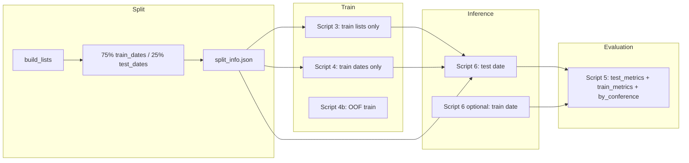

# 75/25 Train–Test Split and Richer Evaluation Metrics

## Goal

1. **75/25 split:** Hold out 25% of data (by time) as a **test set**; train Model A, Model B, and stacking only on the **75% train** portion. Run inference and evaluation on the **test** portion so reported metrics are unbiased.
2. **Metrics that use all data:** Report **train** and **test** metrics in the same eval report (inference on last train date + last test date), and optionally add **per-conference** (East/West) breakdown so you see performance by segment.

---

## Current Behavior

- **Lists:** [src/training/build_lists.py](src/training/build_lists.py) builds conference-date lists; [scripts/3_train_model_a.py](scripts/3_train_model_a.py) and [scripts/4_train_model_b.py](scripts/4_train_model_b.py) use **all** lists for OOF and final training.
- **Inference:** [src/inference/predict.py](src/inference/predict.py) uses the **latest** date across all lists as `target_date` (lines 268–272).
- **Evaluation:** [scripts/5_evaluate.py](scripts/5_evaluate.py) reads one `predictions.json` and writes one `eval_report.json` (ndcg, spearman, mrr, roc_auc_upset, playoff_metrics). No train/test distinction.

---

## 1. Config and Split Definition

- **Config:** Add to [config/defaults.yaml](config/defaults.yaml) under `training`:
  - `train_frac: 0.75` (so test = last 25% of list-dates).
- **Split rule:** Sort lists by `(as_of_date, conference)`; take first 75% of **unique dates** as train, last 25% as test. All lists whose `as_of_date` is in the train dates = train; rest = test. (Using dates keeps time order; no future leakage.)
- **Persistence:** Write `outputs/split_info.json` (or similar) when building the split, containing e.g.:
  - `train_dates`: list of date strings (train)
  - `test_dates`: list of date strings (test)
  - `train_frac`, `n_train_lists`, `n_test_lists`
  So script 4 and script 6 can read the same split without recomputing.

---

## 2. Where to Compute and Persist the Split

- **Option A:** Script 3 computes the split (after `build_lists`), writes `split_info.json`, then filters to train lists for OOF and final model. Script 4 and 6 read `split_info.json`.
- **Option B:** Shared helper (e.g. in `src/training/build_lists.py` or `src/utils/split.py`) that, given `lists` and `train_frac`, returns `(train_lists, test_lists, split_info)` and optionally writes `split_info.json`. Script 3 calls it and uses train_lists; script 4 and 6 call it (or read the file) to get train/test dates.

Recommendation: **Option A** — script 3 computes split, writes `outputs/split_info.json`, and uses only train lists. Script 4 and 6 read that file. Single source of truth; no duplicate logic.

---

## 3. Script 3 (Model A)

- After `build_lists` and filtering to `valid_lists`:
  - Sort unique dates from lists; compute `n_test_dates = max(1, int((1 - train_frac) * n_dates))`; last `n_test_dates` = test_dates, rest = train_dates.
  - Filter to lists with `as_of_date in train_dates` → `train_lists`. Optionally keep `test_lists` for later use or only persist dates.
  - Write `outputs/split_info.json` with `train_dates`, `test_dates`, and counts.
  - Use **train_lists** (not all lists) for OOF (time-based folds within train) and for final model (subsample from train_lists only). No change to OOF/final logic except the input list set.

---

## 4. Script 4 (Model B)

- After `build_lists`, read `outputs/split_info.json`. If missing, fall back to current behavior (all lists) or error.
  - Filter `df` (and thus `flat`) to rows where `as_of_date` is in `train_dates` only. Then build `feat_df`, OOF, and final models on this train subset only.
- Same 75% of dates as Model A.

---

## 5. Script 6 (Inference)

- **Test predictions (primary):** Read `outputs/split_info.json`. Instead of `target_date = dates_sorted[-1]`, set `target_date` to the **last date in test_dates** (so inference runs on the held-out test snapshot). Build `target_lists` from all lists with `as_of_date == target_date` (or in test_dates and take latest). Write predictions to `run_id/predictions.json` as today — this is the **test** prediction set.
- **Train predictions (optional, for metrics):** To report train metrics from “all the data,” either:
  - Run inference a second time with `target_date = last train date`, writing e.g. `run_id/train_predictions.json`, or
  - Add a flag/option to script 6 (e.g. `--split train`) that uses last train date and writes to a separate file. Script 5 then can evaluate both files and report train_metrics and test_metrics.

Recommendation: **Single inference run for test** (current behavior but with test date). **Optional second output** for train: e.g. script 6 writes `predictions.json` (test) and, if a config flag is set, also `train_predictions.json`; script 5 evaluates both and adds `train_metrics` and `test_metrics` to the report.

---

## 6. Script 5 (Evaluation) and Richer Metrics

- **Primary:** Evaluate `run_id/predictions.json` (test) as today → fill `eval_report.json` with a **test_metrics** section (ndcg, spearman, mrr, roc_auc_upset, playoff_metrics when applicable).
- **Train metrics (use all data):** If `run_id/train_predictions.json` exists, evaluate it and add a **train_metrics** section with the same metric set. Then the report “gleans useful information from all the data” by comparing train vs test (overfit check, calibration).
- **Per-conference breakdown:** For the test (and optionally train) predictions, compute NDCG and Spearman **per conference** (East vs West) using the same logic as global but filtered by `team_id_to_conference`. Add to report e.g. `test_metrics_by_conference: { "E": { "ndcg": ..., "spearman": ... }, "W": { ... } }`. Requires conference in predictions (already present via analysis or team_id_to_conf).
- **Summary in report:** Add `split_info` (or key fields): `train_frac`, `n_train_dates`, `n_test_dates`, `eval_on` (e.g. "test" or "test+train"), so the report is self-describing.

---

## 7. Data Flow (High Level)




---

## 8. File and Config Changes Summary


| Item                                                                                                             | Change                                                                                                                                                                              |
| ---------------------------------------------------------------------------------------------------------------- | ----------------------------------------------------------------------------------------------------------------------------------------------------------------------------------- |
| [config/defaults.yaml](config/defaults.yaml)                                                                     | Add `training.train_frac: 0.75`.                                                                                                                                                    |
| [scripts/3_train_model_a.py](scripts/3_train_model_a.py)                                                         | Compute 75/25 split from list dates; write `split_info.json`; use only train lists for OOF and final model.                                                                         |
| [scripts/4_train_model_b.py](scripts/4_train_model_b.py)                                                         | Read `split_info.json`; filter to train_dates only for all training and final fit.                                                                                                  |
| [scripts/6_run_inference.py](scripts/6_run_inference.py) or [src/inference/predict.py](src/inference/predict.py) | Read `split_info.json`; use last test date for primary predictions; optionally last train date for `train_predictions.json` (config flag).                                          |
| [scripts/5_evaluate.py](scripts/5_evaluate.py)                                                                   | Evaluate test predictions → `test_metrics`; if train_predictions.json exists → `train_metrics`; add per-conference NDCG/Spearman for test (and train); add split summary to report. |
| New                                                                                                              | `outputs/split_info.json` (written by script 3, read by 4, 6, 5).                                                                                                                   |


---

## 9. Edge Cases

- **Not enough dates:** If there are very few unique dates (e.g. &lt; 5), keep a minimum of 1 test date; otherwise test set would be empty.
- **split_info.json missing:** Script 4 and 6 can fall back to “use all data” (current behavior) with a warning, or require the file (fail fast). Recommendation: require it so 75/25 is explicit once script 3 has been run.
- **Playoff metrics:** Same as today: only when ≥16 teams have playoff_rank; can be reported under both train_metrics and test_metrics when the corresponding predictions have playoff data.

---

## 10. Resulting eval_report.json Shape (Example)

```json
{
  "split_info": { "train_frac": 0.75, "n_train_dates": 150, "n_test_dates": 50 },
  "test_metrics": { "ndcg": ..., "spearman": ..., "mrr": ..., "roc_auc_upset": ..., "playoff_metrics": { ... } },
  "train_metrics": { "ndcg": ..., "spearman": ..., ... },
  "test_metrics_by_conference": { "E": { "ndcg": ..., "spearman": ... }, "W": { ... } },
  "train_metrics_by_conference": { ... },
  "notes": { ... }
}
```

This gives a 75/25 split and metrics that use both train and test data (and by conference) for clearer insight.