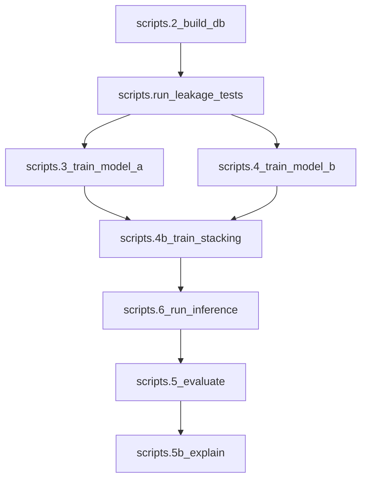

# Fix All Issues for Trustworthy Final Pipeline Run

## Current State Summary

The **current eval_report.json** shows improved metrics (ndcg 0.64, spearman 0.72, roc_auc_upset 0.63), but several issues remain:

1. **Attention weights still 0.0** for all teams (ANALYSIS.md)
2. **Playoff metrics missing** from eval_report (no `playoff_metrics` section)
3. **MRR is 0** (expected given evaluation definition)
4. **Hyperparameters** not aligned with sweep recommendations
5. **Roster contamination** suspected (wrong-team players)

---

## Issue 1: Attention Weights All Zero

### Root Cause Analysis

The [set_attention.py](src/models/set_attention.py) already has masked mean for query (lines 30-35), so that fix is in place. The issue is likely:

1. **Minutes reweighting** (lines 38-45) may collapse weights when minutes are small:

```python
w = w * (0.5 + 0.5 * mins.unsqueeze(1))
w = w / (w.sum(dim=-1, keepdim=True) + 1e-8)
```

When `mins` is small (near 0), `0.5 + 0.5 * mins` approaches 0.5, but if all players have similar small minutes, the reweighted attention sums may become unstable.

2. **Training epochs** - ANALYSIS.md reports flat loss 27.8993 across 3 epochs. Current config has `epochs: 20`, but if training used an old checkpoint or the model was not retrained, attention could still be untrained.

### Fix

- [set_attention.py](src/models/set_attention.py): Simplify or make minutes reweighting optional:

```python
# Option A: Make minutes reweighting configurable
# Option B: Return raw attention weights separately for debugging
# Option C: Only apply minutes as soft bias, not multiplicative
if minutes is not None and w.shape[-1] == minutes.shape[-1]:
    mins = minutes
    if key_padding_mask is not None and key_padding_mask.shape == minutes.shape:
        mins = mins.masked_fill(key_padding_mask, 0.0)
    mins = mins.clamp(min=0.0)
    mins_norm = mins / (mins.sum(dim=-1, keepdim=True).clamp(min=1e-8))
    # Soft bias: 0.7 * attention + 0.3 * minutes (instead of multiplicative)
    w_raw = w.clone()
    w = 0.7 * w + 0.3 * mins_norm.unsqueeze(1)
    w = w / (w.sum(dim=-1, keepdim=True) + 1e-8)
```

- [train_model_a.py](src/training/train_model_a.py): Add persistent attention diagnostics at end of training:

```python
# After training, log final attention stats
with torch.no_grad():
    scores, attn_list = predict_batches_with_attention(model, batches[-1:], device)
    attn = attn_list[0]
    print(f"Final attention stats: min={attn.min():.6f}, max={attn.max():.6f}, sum={attn.sum(dim=-1).mean():.4f}")
```

---

## Issue 2: Pipeline Order Bug (CRITICAL)

### Root Cause Analysis

In [scripts/run_full_pipeline.py](scripts/run_full_pipeline.py), the steps are ordered incorrectly:
- **Current order:** ... → evaluate → explain → inference
- **Correct order:** ... → inference → evaluate → explain

This causes `eval_report.json` to be computed on the **previous** run's predictions, not the current run.

### Fix

Reorder steps in `run_full_pipeline.py`:

```python
# Correct order:
# 1. download_raw
# 2. build_db
# 3. run_leakage_tests  # ADD THIS
# 4. train_model_a
# 5. train_model_b
# 6. train_stacking
# 7. run_inference      # BEFORE evaluate
# 8. evaluate           # AFTER inference
# 9. explain
```

---

## Issue 3: Evaluation Fallback Chain (CRITICAL)

### Root Cause Analysis

In [scripts/5_evaluate.py](scripts/5_evaluate.py), there's a fallback chain:
```python
act = analysis.get("EOS_global_rank")
if act is None:
    act = analysis.get("actual_global_rank")
if act is None:
    act = analysis.get("EOS_conference_rank")
```

This mixes 1-30 and 1-15 scales, producing misleading metrics.

### Fix

Remove the fallback chain. Use **only** `EOS_global_rank` and fail fast if missing:

```python
act = analysis.get("EOS_global_rank")
if act is None:
    print(f"Warning: Missing EOS_global_rank for team {t.get('team_name')}")
    continue  # Skip this team in metrics
```

---

## Issue 4: Model Existence Validation

### Root Cause Analysis

In [src/inference/predict.py](src/inference/predict.py), if no models are loaded, inference silently produces zeroed outputs instead of failing.

### Fix

Add model existence validation at the start of `run_inference_from_db`:

```python
if model_a is None and xgb is None and rf is None:
    raise RuntimeError("No models loaded. Run training scripts (3, 4, 4b) first.")
```

---

## Issue 5: Attention Fallback Policy

### Root Cause Analysis

Current code fabricates zero-weight contributors when attention is all zero/non-finite. This is misleading.

### Fix

In `predict.py`, improve the fallback policy:

```python
if not contrib and max_len > 0:
    # Don't fabricate - mark as fallback with empty list
    attention_by_team[tid] = []
    attention_fallback_by_team[tid] = True
```

---

## Issue 6: Playoff Rank Not Working (All 17-30)

### Root Cause Analysis

In [playoffs.py](src/evaluation/playoffs.py) line 166-167:

```python
if len(playoff_team_ids) < 16:
    return {}
```

This is too strict. If playoff data is incomplete or season filtering yields fewer than 16 teams, the function returns empty, causing all teams to get `playoff_rank: null`.

Additionally, [predict.py](src/inference/predict.py) lines 413-440 correctly pass `season_start` and `season_end` to `compute_playoff_performance_rank`, but we need to verify the dates match the target season.

### Fix

- [playoffs.py](src/evaluation/playoffs.py):
  - Relax the `< 16` check to allow incomplete data:

```python
# Line 166-167: Relax threshold and add logging
MIN_PLAYOFF_TEAMS = 8  # Allow partial playoff data
if len(playoff_team_ids) < MIN_PLAYOFF_TEAMS:
    print(f"Warning: Only {len(playoff_team_ids)} playoff teams found (min {MIN_PLAYOFF_TEAMS}). Returning empty.")
    return {}
```

- Add debug logging to verify date filtering is working:

```python
# In _filtered_playoff_tgl, add:
print(f"Playoff filtering: season={season}, start={season_start}, end={season_end}, games_before={len(pg)}, games_after={len(result)}")
```

---

## Issue 3: Roster Contamination

### Root Cause Analysis

ANALYSIS.md reports wrong-team players (e.g., Simons on Boston). The [build_roster_set.py](src/features/build_roster_set.py) `latest_team_map_as_of()` function builds a map of player -> latest team as of `as_of_date`. The issue is:

1. `season_start` might not be passed, causing the map to include games from previous seasons
2. The `latest_team_map` might use current-season data when `as_of_date` is set to a date in a past season

### Fix

- [build_roster_set.py](src/features/build_roster_set.py): Add debug logging and enforce season boundaries:

```python
# In get_roster_as_of_date, after building latest_team_map:
print(f"Roster for team {team_id} as_of {as_of_date}: {len(latest_team_map)} players in map, season_start={season_start}")
```

- [data_model_a.py](src/training/data_model_a.py): Verify `season_start` is passed to `get_roster_as_of_date`

---

## Issue 4: Hyperparameters Not Aligned with Sweeps

### Current vs Recommended (from Performance_trajectory doc)

| Parameter | Current | Sweep Best (NDCG) | Sweep Best (Spearman) |
|-----------|---------|-------------------|----------------------|
| model_a.epochs | 20 | 28 | 15 |
| model_a.early_stopping_patience | 3 | 0 (no early stop) | 3 |
| model_a.early_stopping_val_frac | 0.1 | 0.25 | 0.25 |
| model_b.xgb.n_estimators | 500 | 250 | 250 |
| model_b.xgb.max_depth | 6 | 4 | 4 |
| model_b.xgb.learning_rate | 0.05 | 0.08 | 0.08 |

### Fix

Update [config/defaults.yaml](config/defaults.yaml):

```yaml
model_a:
  epochs: 28                    # Sweep best for NDCG
  early_stopping_patience: 0    # Disable to reach epoch 28
  early_stopping_val_frac: 0.25 # Larger val for robustness

model_b:
  xgb:
    n_estimators: 250           # Sweep best
    max_depth: 4                # Sweep best
    learning_rate: 0.08         # Sweep best
```

---

## Issue 5: Pre-flight Validation Script

Create a validation script that checks all prerequisites before a full pipeline run.

### New file: [scripts/preflight_check.py](scripts/preflight_check.py)

```python
"""Pre-flight check: verify DB, config, and model prerequisites."""
# Checks:
# 1. DB exists and has required tables
# 2. Config has valid season boundaries
# 3. Raw data files exist
# 4. No stale model files (optional: remove to force retrain)
# 5. Playoff data exists for target season
```

---

## Implementation Order

1. **Fix pipeline order** in run_full_pipeline.py (CRITICAL - inference before evaluate)
2. **Fix evaluation fallback chain** in 5_evaluate.py (CRITICAL - use only EOS_global_rank)
3. **Add model validation** in predict.py (abort if no models)
4. **Update hyperparameters** in defaults.yaml (sweep-aligned)
5. **Fix set_attention.py** minutes reweighting (simplify or make optional)
6. **Fix attention fallback policy** in predict.py (don't fabricate zero-weight contributors)
7. **Fix playoffs.py** relaxed threshold + debug logging
8. **Add roster debug logging** in build_roster_set.py
9. **Add leakage tests** to run_full_pipeline.py
10. **Create preflight_check.py** for validation
11. **Delete old model checkpoints** to force full retrain
12. **Run full pipeline** and verify all metrics
13. **Update Performance_trajectory.md** with final results

---

## Verification Checklist (After Pipeline Run)

**Pipeline / Eval Integrity:**
- [ ] `eval_report.json` references the **same run_id** just produced (not stale)
- [ ] No model loading errors or zeroed outputs in inference
- [ ] Leakage tests pass before training

**Attention / Explainability:**
- [ ] Attention weights in predictions.json are non-zero for some teams
- [ ] `attn_sum_mean` in training/inference logs is close to 1.0
- [ ] `contributors_are_fallback` is false for most teams (not all fallbacks)
- [ ] Loss decreases during training (not flat at 27.8993)

**Playoff / Roster:**
- [ ] Playoff metrics present in eval_report.json (`playoff_metrics` section)
- [ ] `playoff_rank` in predictions.json includes values 1-16 (not all 17-30)
- [ ] No roster contamination (spot-check Boston, Milwaukee rosters)

**Performance:**
- [ ] NDCG >= 0.64, Spearman >= 0.72 (maintain or improve)
- [ ] MRR may still be 0 (expected given top-2 definition)

---

## Files to Modify

| File | Changes |
|------|---------|
| [scripts/run_full_pipeline.py](scripts/run_full_pipeline.py) | **CRITICAL:** Reorder to run inference BEFORE evaluate; add leakage tests |
| [scripts/5_evaluate.py](scripts/5_evaluate.py) | **CRITICAL:** Remove EOS_global_rank fallback chain; fail fast if missing |
| [src/inference/predict.py](src/inference/predict.py) | Add model existence validation; fix attention fallback policy |
| [config/defaults.yaml](config/defaults.yaml) | Update epochs=28, val_frac=0.25, XGB 250/4/0.08 |
| [src/models/set_attention.py](src/models/set_attention.py) | Simplify minutes reweighting to soft bias |
| [src/evaluation/playoffs.py](src/evaluation/playoffs.py) | Relax threshold from 16 to 8, add debug logging |
| [src/features/build_roster_set.py](src/features/build_roster_set.py) | Add roster debug logging |
| [src/training/train_model_a.py](src/training/train_model_a.py) | Add final attention stats logging |
| [scripts/preflight_check.py](scripts/preflight_check.py) | New validation script |
| [.cursor/plans/Performance_trajectory_and_hyperparameters.md](.cursor/plans/Performance_trajectory_and_hyperparameters.md) | Update with fixes and final hyperparams |

## Pipeline Flow (Corrected)


