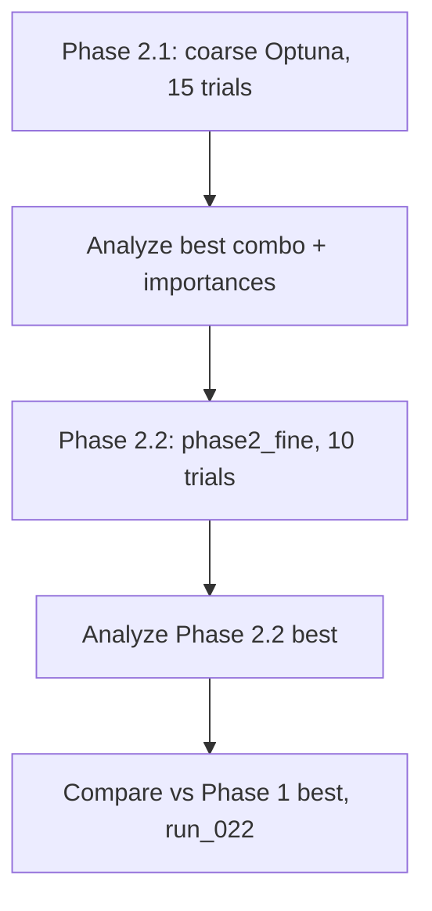

# Phase 2 Granular Sweep Plan

Granular, analysis-driven hyperparameter sweep strategy to narrow and refine the search space. Builds on [PHASE2_SWEEP_PLAN.md](PHASE2_SWEEP_PLAN.md), [outputs4/sweeps/SWEEP_PHASE1_ANALYSIS.md](../../outputs4/sweeps/SWEEP_PHASE1_ANALYSIS.md), and rolling sweep findings.

---

## 1. Evidence Summary

### Best configs to date

| Source | Spearman | Key params |
|--------|----------|------------|
| **Phase 1 (outputs3 combo 10)** | 0.499 | epochs 21, max_depth 5, lr 0.0704, n_xgb 291, n_rf 164, min_leaf 4, rolling [10,30] |
| **Rolling best (outputs4 combo 7)** | **0.496** | epochs 24, max_depth 5, lr 0.086, n_xgb 204, n_rf 226, min_leaf 5, **rolling [15,30]** |

### Optuna importances (phase1_spearman_final_rank)

| Param | Importance | Action |
|-------|------------|--------|
| n_estimators_rf | 0.26 | Vary in Phase 2 |
| n_estimators_xgb | 0.21 | Vary in Phase 2 |
| learning_rate | 0.21 | Vary in Phase 2 |
| model_a_epochs | 0.19 | Vary in Phase 2 |
| max_depth | 0.13 | Narrow (4–5) or fix at 5 |
| min_samples_leaf | ~0.01 | **Fix** at 5 (rolling best) |
| subsample, colsample, rolling_windows | 0 | **Fix** |

### Fixed params (from analysis)

- **rolling_windows: [15, 30]** — rolling sweep clearly best
- **subsample: 0.8**, **colsample_bytree: 0.7**
- **min_samples_leaf: 5** (rolling best; Optuna low-importance)

---

## 2. Granular Sweep Phases

### Phase 2.1 — Coarse refinement (Optuna, ~12–15 trials)

**Goal:** Identify best region in narrowed space; confirm high-importance param directions.

**Fixed:** rolling [15, 30], subsample 0.8, colsample 0.7, min_leaf 5

**Varied (narrowed around evidence):**

| Param | Range | Rationale |
|-------|-------|-----------|
| model_a_epochs | 20–24 | Center 22; both Phase 1 (21) and rolling (24) in band |
| max_depth | [5] or [4, 5] | Both best configs used 5; fix or binary |
| learning_rate | 0.065–0.09 (log) | Captures 0.0704 and 0.086 |
| n_estimators_xgb | 200–300 | Covers 204 (rolling) and 291 (Phase 1) |
| n_estimators_rf | 150–230 | Covers 164 (Phase 1) and 226 (rolling) |

**Sweep:** `--phase phase2` (updated to use [15, 30] and min_leaf 5)

```bash
python -m scripts.sweep_hparams --method optuna --n-trials 15 --n-jobs 4 --objective spearman --listmle-target final_rank --phase phase2 --batch-id phase2_coarse_spearman_final_rank --config config/outputs4_phase1.yaml
```

**Output:** `outputs4/sweeps/phase2_coarse_spearman_final_rank/` — best combo, optuna_importances.json for Phase 2.2.

---

### Phase 2.2 — Fine refinement (local grid or small Optuna, ~8–12 trials)

**Goal:** Refine around Phase 2.1 best with very narrow ranges; minimal compute, high precision.

**Input:** Best combo from Phase 2.1 (e.g. epochs=22, lr=0.078, n_xgb=240, n_rf=195, max_depth=5).

**Fixed:** Same as Phase 2.1 (rolling [15, 30], subsample, colsample, min_leaf 5).

**Varied (local ±δ around best):**

| Param | Fine range | Step/Notes |
|-------|------------|------------|
| model_a_epochs | best ± 2 | e.g. 20–24 if best=22 |
| max_depth | [5] | Fix at best (typically 5) |
| learning_rate | best ± 0.015 | e.g. 0.063–0.093 if best=0.078 |
| n_estimators_xgb | best ± 30 | e.g. 210–270 if best=240 |
| n_estimators_rf | best ± 25 | e.g. 170–220 if best=195 |

**Sweep:** `--phase phase2_fine` with center params from Phase 2.1 best (config-driven or script arg).

```bash
# After Phase 2.1, extract best params from sweep_results_summary.json and run:
python -m scripts.sweep_hparams --method optuna --n-trials 10 --n-jobs 4 --objective spearman --listmle-target final_rank --phase phase2_fine --batch-id phase2_fine_spearman_final_rank --config config/outputs4_phase1.yaml
```

**Alternative:** Small grid (e.g. 2×2×2×2 = 16 combos) if phase2_fine uses discrete lists.

---

### Phase 2.3 (optional) — Secondary objectives

If time permits, run Phase 2.1-style sweeps for:

- **playoff_spearman** — `--objective playoff_spearman`
- **rank_rmse** — `--objective rank_rmse` (minimize)

Use same fixed params; compare best configs across objectives.

---

## 3. Implementation

### sweep_hparams.py changes

1. **phase2:** Set `rolling_list = [[15, 30]]`, `min_leaf_list = [5]`; narrow epochs to 20–24, lr to 0.065–0.09, n_xgb 200–300, n_rf 150–230.
2. **phase2_fine:** Add new phase with very narrow ranges. Either:
   - **Option A:** Hardcode center from Phase 2.1 best (epochs 21–24, lr 0.07–0.09, n_xgb 210–270, n_rf 170–220).
   - **Option B:** Read center from a config file or `--phase2-best-config` path.

### Config

Add optional `config/outputs4_phase2.yaml` or extend `outputs4_phase1.yaml` with:

```yaml
sweep:
  phase2_fine:
    # Populate after Phase 2.1; used when --phase phase2_fine
    center:
      model_a_epochs: 22
      learning_rate: 0.078
      n_estimators_xgb: 240
      n_estimators_rf: 195
      max_depth: 5
```

---

## 4. Execution Order



| Step | Action | Batch ID |
|------|--------|----------|
| 1 | Run Phase 2.1 | phase2_coarse_spearman_final_rank |
| 2 | Analyze; update phase2_fine center if needed | — |
| 3 | Run Phase 2.2 | phase2_fine_spearman_final_rank |
| 4 | Compare and lock best | — |

---

## 5. Success Criteria

- Phase 2.2 best **Spearman ≥ 0.496** (match or beat rolling best).
- Phase 2.2 best **playoff_spearman ≥ 0.501**.
- Document Phase 2 best config in `outputs4/sweeps/SWEEP_PHASE2_ANALYSIS.md` (create after runs).
