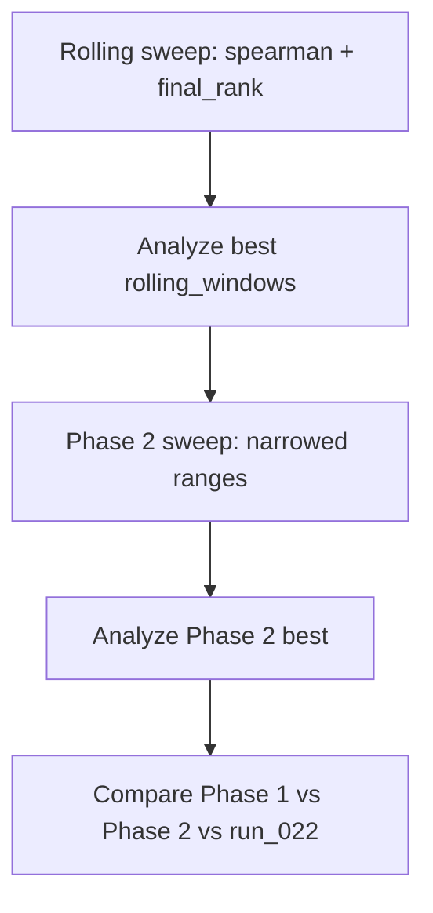

# Phase 2 Sweep Plan

Plan for the next round of hyperparameter sweeps, per [phased_sweep_roadmap_3hr_6b5aa588.plan.md](.cursor/plans/phased_sweep_roadmap_3hr_6b5aa588.plan.md) and [phased_sweep_execution_plan_d0f3e0a3.plan.md](.cursor/plans/phased_sweep_execution_plan_d0f3e0a3.plan.md).

---

## Prerequisites (Complete Before Phase 2)

1. **Rolling windows sweep** — Run with best objective and listmle_target from Phase 1:
   - **Objective:** spearman
   - **listmle_target:** final_rank (Phase 1 spearman_final_rank outperformed playoff_outcome)
   - **Phase:** rolling
   - **Options tested:** [10], [10, 30], [15, 30], [20, 30]

```bash
python -m scripts.sweep_hparams --method optuna --n-trials 12 --n-jobs 4 --no-run-explain --objective spearman --listmle-target final_rank --phase rolling --batch-id phase1_rolling_spearman_final_rank --config config/outputs4_phase1.yaml
```

2. **Remaining Phase 1 sweeps (optional)** — ndcg4, ndcg16, ndcg20, playoff_spearman, rank_rmse. Run on WSL or after Triton fix. See [outputs4_phase_i_sweeps](.cursor/plans/outputs4_phase_i_sweeps_2638c514.plan.md) §2.4 for sequential commands.

---

## Phase 2 Design (Post-Rolling)

### Inputs from Phase 1 (outputs3)

**Best config (phase1_spearman_final_rank combo 10 + rolling sweep combo 7):**
- model_a_epochs: 21 (or 24 from rolling best)
- max_depth: 5
- learning_rate: 0.0704 (or 0.086 from rolling best)
- n_estimators_xgb: 291 (or 204 from rolling best)
- n_estimators_rf: 164 (or 226 from rolling best)
- min_samples_leaf: 4 (or 5 from rolling best)
- subsample: 0.8, colsample_bytree: 0.7
- **rolling_windows: [15, 30]** ← from rolling sweep (combo 7 best: Spearman 0.496, playoff_spearman 0.501)

**Optuna importances (phase1_spearman_final_rank):**
- n_estimators_rf: 0.26
- n_estimators_xgb: 0.21
- learning_rate: 0.21
- model_a_epochs: 0.19
- max_depth: 0.13
- min_samples_leaf: 0.008 (low — fix)
- subsample, rolling_windows, colsample_bytree: 0 (fix at default)

### Phase 2 Strategy

1. **Fix low-importance params** at Phase 1 best or default:
   - subsample: 0.8
   - colsample_bytree: 0.7
   - **rolling_windows: [15, 30]** (from rolling sweep — clearly best)
   - min_samples_leaf: 4 (or narrow to 4–5)

2. **Narrow high-importance params** around Phase 1 best:
   - model_a_epochs: 18–24 (center 21)
   - max_depth: 4–5 (or 5 fixed)
   - learning_rate: 0.06–0.08
   - n_estimators_xgb: 270–310
   - n_estimators_rf: 150–180

3. **Phase 2 sweep phases** (add to sweep_hparams if not present):
   - `--phase phase2` — narrowed ranges above; single objective (spearman or playoff_spearman)
   - Or use `--phase phase1_xgb` / `phase2_rf` for focused Model B tuning with Model A fixed

### Phase 2 Objectives

- **Primary:** spearman (maximize) with listmle_target=final_rank
- **Secondary:** playoff_spearman, rank_rmse (if time permits)
- **Config:** config/outputs4_phase1.yaml (outputs4, run_025+)

---

## Execution Order

1. ~~**Rolling sweep** — phase1_rolling_spearman_final_rank~~ **Done.**
2. ~~**Analyze rolling** — Document best rolling_windows; update config~~ **Done.** Best: [15, 30]. See `outputs4/sweeps/SWEEP_PHASE1_ANALYSIS.md`.
3. **Phase 2.1 (coarse)** — Run `--phase phase2` spearman + final_rank; ~15 trials. See [PHASE2_GRANULAR_SWEEP_PLAN.md](PHASE2_GRANULAR_SWEEP_PLAN.md).
4. **Phase 2.2 (fine)** — Run `--phase phase2_fine` around Phase 2.1 best; ~10 trials.
5. **Compare** — Phase 2 best vs Phase 1 best vs run_022

---

## File Changes for Phase 2

| File | Change |
|------|--------|
| `scripts/sweep_hparams.py` | **Done.** `phase2` (coarse) + `phase2_fine` added. phase2: rolling [15,30], epochs 20–24, lr 0.065–0.09, n_xgb 200–300, n_rf 150–230, max_depth 5, min_leaf 5. phase2_fine: narrower. |
| `.cursor/plans/PHASE2_GRANULAR_SWEEP_PLAN.md` | **Done.** Granular sub-phases, evidence summary, execution order. |
| `config/outputs4_phase1.yaml` | Optionally add `sweep.phase2` section with phase2 ranges |
| `outputs4/sweeps/SWEEP_PHASE1_ANALYSIS.md` | **Done.** Rolling sweep results and inferences added |

---

## Mermaid: Phase 2 Flow


