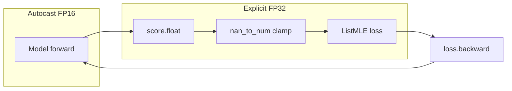

# AMP for Model A with Float32-Safe Loss

## Goal

Enable PyTorch AMP (Automatic Mixed Precision) so the RTX 4060 can run Model A faster, while **keeping numerically sensitive code in float32**: the ListMLE loss, score clamping/nan_to_num, and any normalization that feeds the loss.

## Scope

- **Training:** [src/training/train_model_a.py](src/training/train_model_a.py) — `train_epoch`, `eval_epoch`, and the call sites that build/use a GradScaler (`train_model_a_on_batches`, `run_training`).
- **Loss:** [src/models/listmle_loss.py](src/models/listmle_loss.py) — **no changes**; it will always receive float32 tensors.
- **Config:** [config/defaults.yaml](config/defaults.yaml) — add `model_a.use_amp` (default `true` when CUDA available, or `false` for conservative default).
- **Inference (optional):** [src/inference/predict.py](src/inference/predict.py) and the prediction helpers in [src/training/train_model_a.py](src/training/train_model_a.py) (`predict_batches`, `predict_batches_with_attention`) — optional autocast for forward-only; outputs cast to float32 before leaving the function.

## Design: What runs in float16 vs float32

- **Under autocast (float16):** Only the **model forward** (`model(embs, stats, minutes, mask)`). This gives most of the speed gain on GPU.
- **In float32:** Everything from **model output** to **loss**: cast `score` to `.float()` immediately after the forward, then `nan_to_num` / reshape, then `listmle_loss(score, rel)`. `rel` is already float32 from the data pipeline. No changes inside `listmle_loss.py`; it continues to use float32 only.

## Implementation steps

### 1. Config flag

- In **config/defaults.yaml** under `model_a:`, add:
  - `use_amp: true` (or `false` for a conservative default; recommend `true` when targeting GPU).
- Document in README that AMP can be disabled with `model_a.use_amp: false` if numerical issues appear.

### 2. train_epoch in train_model_a.py

- Add optional parameters: `use_amp: bool = False`, `scaler: torch.cuda.amp.GradScaler | None = None`.
- **Forward and loss:**
  - If `use_amp` and `device.type == "cuda"`: wrap the **model call only** in `torch.autocast(device_type="cuda", dtype=torch.float16)`:
    - `with torch.autocast(device_type="cuda", dtype=torch.float16): score, _, _ = model(embs, stats, minutes, mask)`
  - Immediately after the block: `score = score.float().reshape(B, K)` so all subsequent work is float32.
  - Keep existing: `score = torch.nan_to_num(score, nan=0.0, posinf=10.0, neginf=-10.0)` and `loss = listmle_loss(score, rel)` (unchanged).
- **Backward and step:**
  - If `scaler is not None` and `use_amp` and CUDA: call `scaler.scale(loss).backward()`, then before optimizer step: `scaler.unscale_(optimizer)`, `torch.nn.utils.clip_grad_norm_(model.parameters(), max_norm=grad_clip_max_norm)`, then `scaler.step(optimizer)`, `scaler.update()`. Omit the non-scaler `loss.backward()` and `optimizer.step()` in that branch.
  - Else: keep current behavior: `loss.backward()`, clip_grad_norm_, `optimizer.step()`.
- When using the scaler, call `optimizer.zero_grad(set_to_none=True)` at the start of the iteration (or keep zero_grad as-is; scaler semantics prefer zero_grad before backward). Ensure `zero_grad` is called once per step.

### 3. eval_epoch in train_model_a.py

- Add optional `use_amp: bool = False`.
- If `use_amp` and CUDA: wrap the model forward in `torch.autocast(device_type="cuda", dtype=torch.float16)`; then `score = score.float().reshape(B, K)` and existing nan_to_num and listmle_loss (no scaler in eval).

### 4. GradScaler lifecycle and call sites

- In **train_model_a_on_batches** (and any other path that calls `train_epoch` in a loop): read `use_amp = config.get("model_a", {}).get("use_amp", False)` and only create a scaler when `use_amp and device.type == "cuda"`: e.g. `scaler = torch.cuda.amp.GradScaler() if (use_amp and device.type == "cuda") else None`.
- Pass `use_amp` and `scaler` into every `train_epoch(...)` call.
- For **eval_epoch**, pass `use_amp` only (no scaler).

### 5. run_training (script 3 entry point)

- In the function that loads config and calls `train_model_a_on_batches` / `run_training`, ensure the config’s `model_a.use_amp` is passed through so the scaler is created and used when AMP is enabled on CUDA. If there is a `run_training` that builds the optimizer and calls `train_epoch` in a loop, create the scaler there when `use_amp` and CUDA, and pass it into `train_epoch`.

### 6. ListMLE and data pipeline

- **No changes** to [src/models/listmle_loss.py](src/models/listmle_loss.py). It continues to receive float32 `scores` and `rel`; all operations (clamp, logsumexp, gather, sort) remain in float32.
- **No changes** to [src/training/data_model_a.py](src/training/data_model_a.py); data can stay float32. If desired, inputs can stay float32 and only the model internals run in float16 under autocast.

### 7. Inference (optional)

- In **predict_batches** and **predict_batches_with_attention** in [src/training/train_model_a.py](src/training/train_model_a.py): if a small speedup is desired, wrap the model forward in `torch.autocast(device_type="cuda", dtype=torch.float16)` when `device.type == "cuda"`, then cast the returned scores (and attention weights if any) to `.float()` before `.cpu()` so callers still receive float32. Same idea in [src/inference/predict.py](src/inference/predict.py) where Model A is run: autocast the forward, cast outputs to float32 before use. This step is optional and can be a follow-up.

## Edge cases and safety

- **CPU:** When `device.type != "cuda"`, do not use autocast or scaler; keep current float32 path. Check `device.type == "cuda"` before creating the scaler or enabling AMP in train/eval.
- **GradScaler and gradient clipping:** PyTorch requires **unscaling** gradients before clipping when using GradScaler; so the order is: `scaler.scale(loss).backward()` → `scaler.unscale_(optimizer)` → `clip_grad_norm_(model.parameters(), ...)` → `scaler.step(optimizer)` → `scaler.update()`. Check for inf/NaN in scaler before step if desired (`scaler.step` can skip the step when inf/NaN is found).
- **Attention debug:** When `attention_debug` runs, the one-shot forward in `_log_attention_debug_stats` can be left in float32 (no autocast) to avoid changing debug behavior; or run under autocast and cast to float32 for the simple `loss = score.mean()` there. Prefer keeping debug in float32 for consistency with previous runs.

## Files to touch

| File                                                                                                                                         | Change                                                                                                                                                                                                                |
| -------------------------------------------------------------------------------------------------------------------------------------------- | --------------------------------------------------------------------------------------------------------------------------------------------------------------------------------------------------------------------- |
| [config/defaults.yaml](config/defaults.yaml)                                                                                                 | Add `model_a.use_amp: true` (or false).                                                                                                                                                                               |
| [src/training/train_model_a.py](src/training/train_model_a.py)                                                                               | Add use_amp/scaler to train_epoch; autocast forward only; float32 loss path; GradScaler backward/step in train_epoch; use_amp in eval_epoch; create scaler in train_model_a_on_batches/run_training and pass through. |
| [src/models/listmle_loss.py](src/models/listmle_loss.py)                                                                                     | No change (always float32).                                                                                                                                                                                           |
| [README.md](README.md)                                                                                                                       | One line: AMP can be disabled with `model_a.use_amp: false`.                                                                                                                                                          |
| (Optional) [src/training/train_model_a.py](src/training/train_model_a.py) predict_* and [src/inference/predict.py](src/inference/predict.py) | Optional autocast on Model A forward; cast outputs to float32.                                                                                                                                                        |

## Verification

- With `model_a.use_amp: true` and CUDA: run script 3 (or a short dummy run); confirm no NaN/Inf in loss and that training completes. Compare loss curve or final metric with a non-AMP run to ensure parity (small differences are acceptable).
- With `model_a.use_amp: false` or CPU: behavior unchanged from current code.

