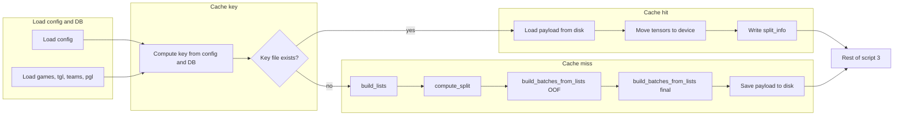

# Batch cache for hyperparameter sweeps

## Goal

Save built lists and batches to disk and reuse them when the same config (listmle_target, rolling_windows, train_seasons, DB, etc.) is used again. This applies within a sweep (all trials share the same batches when only model hyperparams like epochs/lr differ) and across runs (e.g. rerunning the same sweep or running a different objective with the same listmle_target). No code changes to the sweep script are required beyond script 3 and config; the sweep already passes `--config` per trial.

## When batches are reusable

Batches are identical when all of the following match:

- **Lists:** `listmle_target`, `train_seasons` (order-independent), DB path + identity (path and mtime/size so DB changes invalidate cache), and the list-building logic (build_lists uses config seasons + playoff data).
- **Batches from lists:** `rolling_windows`, `roster_size`, `stat_dim`, `num_embeddings`, `use_prior_season_baseline`, `prior_season_lookback_days`, and the subsampling that produces `oof_lists` / `all_lists`: `max_lists_oof`, `max_final_batches`, `n_folds`.

So the cache key must include these; it must **exclude** hyperparameters that do not affect lists/batches (epochs, lr, n_xgb, n_rf, max_depth, subsample, colsample_bytree, min_samples_leaf, etc.).

## Cache key

Compute a deterministic key from:

- `training.listmle_target`
- `training.rolling_windows` (tuple)
- `training.train_seasons` (sorted tuple)
- `training.max_lists_oof`, `training.max_final_batches`, `training.n_folds`
- `training.roster_size`, `training.use_prior_season_baseline`, `training.prior_season_lookback_days`
- `model_a.stat_dim`, `model_a.num_embeddings`
- DB identity: `paths.db` (resolved) + file mtime and size (or hash of first N bytes) so DB content changes invalidate the cache

Serialize a dict of these (sorted keys, stable repr) and hash with SHA256; use the hex digest as the cache key (e.g. first 16 chars to keep filenames short).

## What to cache (payload)

Script 3’s “normal” OOF path (after `compute_split`, with enough lists for OOF) produces:

1. **split_info** — from `compute_split(valid_lists, config)`; needed to call `write_split_info` and to know train/test.
2. **oof_lists** — list of list dicts (team_ids, win_rates, as_of_date, conference, final_rank if any); used to derive `sorted_indices` for folds.
3. **train_lists** — used to build `all_lists` (subsampled by max_final_batches); cache the subsampled **all_lists** to avoid re-subsampling.
4. **oof_batches** — list of batch dicts (tensors) from `build_batches_from_lists(oof_lists, ...)`.
5. **list_metas** — list of metas for oof (same length as oof_batches); script 3 uses `list_metas[i]` for val_metas in the fold loop.
6. **all_batches** — list of batch dicts from `build_batches_from_lists(all_lists, ...)`.

Save tensors on CPU so the cache is device-agnostic; on load, move to the current device (cuda/cpu).

## Where to store the cache

- **Config:** Add optional `paths.batch_cache` (e.g. `null` or a path). If `null` or missing, use a default under the project: e.g. `{paths.outputs}/batch_cache` or `data/processed/batch_cache` so it lives with the project and can be reused across sweep batch_ids.
- **Layout:** One file per key, e.g. `{batch_cache_dir}/{key_hex}.pt`. Use a single `torch.save` payload (dict with the six items above; tensors on CPU).

## Script 3 flow (high level)

- **After** loading config and DB (games, tgl, teams, pgl) and resolving `paths.batch_cache`:
  1. Compute the cache key from config + DB path + DB mtime/size.
  2. If `batch_cache_dir / f"{key}.pt"` exists: load the payload, move `oof_batches` and `all_batches` tensors to `device`, write `split_info` via existing `write_split_info`, then jump to the “Time-based fold split” section (line ~258) using cached `oof_batches`, `list_metas`, and later cached `all_batches`. Skip `build_lists`, `compute_split`, and both `build_batches_from_lists` calls.
  3. If the file does not exist: run the current build path (build_lists, compute_split, subsample oof_lists, build_batches_from_lists for OOF, then build all_lists and build_batches_from_lists for final). Before the fold loop, save the payload (split_info, oof_lists, train_lists or all_lists, oof_batches, list_metas, all_batches) with tensors on CPU; write to a temp file then rename to `{key}.pt` for atomicity. Then continue with the fold loop and final training as today.
- **Edge cases:** If the current run takes an “early exit” path (no lists, no valid lists, no train lists, n_folds < 2, no oof batches), do **not** read or write the batch cache; keep current behavior (build_batches_from_db or small build_batches_from_lists as today). Only use the cache on the main OOF path where we have oof_lists, train_lists, and both batch builds.

## Files to change

1. **[config/defaults.yaml](config/defaults.yaml)**
  - Under `paths`, add optional `batch_cache: null` (or a path like `outputs3/batch_cache`). Comment that when set, script 3 will cache built batches keyed by config+DB and reuse on cache hit.
2. **[scripts/3_train_model_a.py](scripts/3_train_model_a.py)**
  - Add a helper to compute the cache key from config + db_path (and DB mtime/size).
  - Resolve `batch_cache` dir (default e.g. `outputs/batch_cache` or `data/processed/batch_cache` when `paths.batch_cache` is null).
  - After loading DB and building `valid_lists` (and ensuring we have train_lists, n_folds >= 2, oof_lists), check for cache file. On hit: load, move tensors to device, write_split_info(split_info), then jump to the fold loop (reuse cached oof_batches, list_metas) and later use cached all_batches for final training; skip both batch builds.
  - On miss: after building oof_batches and list_metas (and before the fold loop), build all_batches; then save payload (split_info, oof_lists, all_lists, oof_batches, list_metas, all_batches) with tensors on CPU to `batch_cache_dir / f"{key}.pt"` (write to temp then rename). Then continue as today.
  - Ensure `list_metas` is included in the payload and used on load for the val_metas indexing in the fold loop.
3. **Sweep script**
  - No change. Each trial runs script 3 with `--config combo_XXXX/config.yaml`. The config has the same list/batch-determining fields for all trials in a given sweep (same listmle_target, same rolling_windows from phase, same train_seasons, same DB path). So the cache key will match for all trials after the first; the first trial builds and saves, subsequent trials load.

## Time saved

- Per trial: about **1–3 minutes** (one build_lists + two build_batches_from_lists) when cache is used.
- Per 10-trial sweep: **about 9–27 minutes** (9 trials skip building).
- Across sweeps: if you run another sweep (e.g. different objective) with the same listmle_target and phase (same rolling_windows), the same key is used so batches load from cache for every trial.

## Optional: cache invalidation

- Key already includes DB path + mtime/size, so DB rebuilds invalidate the cache.
- No TTL or manual purge in scope; user can delete the `batch_cache` directory to force full rebuilds.

