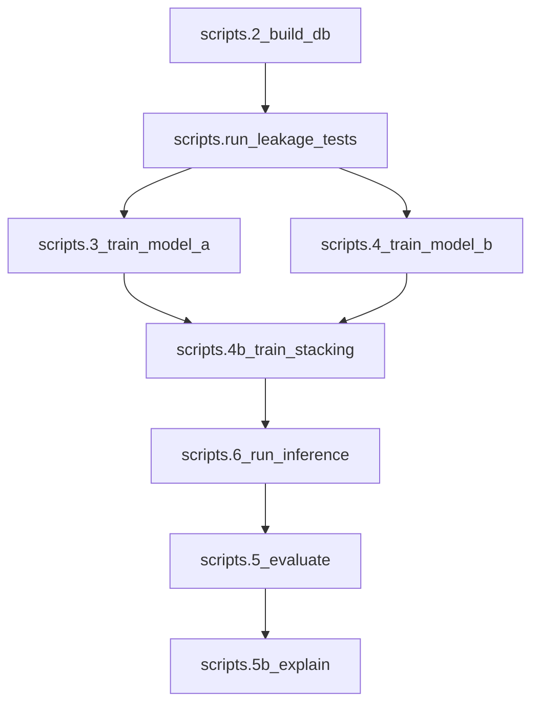

# Fix Attention + Trustworthy Run Plan

## Context notes

- **Context7** MCP is not available in this workspace (no context7 resources listed). I will rely on the existing code and known PyTorch/XGBoost behavior; if you want, we can add a short verification step against official docs once context7 is accessible.

## Key issues found (from code + plans)

- **Attention can collapse** due to minutes reweighting and degenerate minutes (`set_attention.py`), and inference fallback still drops `w <= 0`, producing empty contributors.
- **Evaluation scale mixing** can still happen due to fallback chain in `scripts/5_evaluate.py` (`EOS_global_rank` → `EOS_conference_rank`).
- **Pipeline order is wrong** in `scripts/run_full_pipeline.py` (evaluate before inference), producing stale metrics.
- **Model existence not enforced** in inference: missing models can silently yield zero predictions.
- **Roster contamination** can still occur if latest-team fallback reintroduces wrong-team players.
- **Playoff rank may be incomplete** when data is missing; downstream plotting/metrics should be skipped when ranks are insufficient.

Relevant files:

- [C:\Users\tmakucursor\worktrees\NBA_Playoff_Strentgh_Project\lda\src\models\set_attention.py](C:\Users\tmaku.cursor\worktrees\NBA_Playoff_Strentgh_Project\lda\src\models\set_attention.py)
- [C:\Users\tmakucursor\worktrees\NBA_Playoff_Strentgh_Project\lda\src\training\train_model_a.py](C:\Users\tmaku.cursor\worktrees\NBA_Playoff_Strentgh_Project\lda\src\training\train_model_a.py)
- [C:\Users\tmakucursor\worktrees\NBA_Playoff_Strentgh_Project\lda\src\inference\predict.py](C:\Users\tmaku.cursor\worktrees\NBA_Playoff_Strentgh_Project\lda\src\inference\predict.py)
- [C:\Users\tmakucursor\worktrees\NBA_Playoff_Strentgh_Project\lda\src\evaluation\playoffs.py](C:\Users\tmaku.cursor\worktrees\NBA_Playoff_Strentgh_Project\lda\src\evaluation\playoffs.py)
- [C:\Users\tmakucursor\worktrees\NBA_Playoff_Strentgh_Project\lda\scripts\5_evaluate.py](C:\Users\tmaku.cursor\worktrees\NBA_Playoff_Strentgh_Project\lda\scripts\5_evaluate.py)
- [C:\Users\tmakucursor\worktrees\NBA_Playoff_Strentgh_Project\lda\scripts\run_full_pipeline.py](C:\Users\tmaku.cursor\worktrees\NBA_Playoff_Strentgh_Project\lda\scripts\run_full_pipeline.py)
- [C:\Users\tmakucursor\worktrees\NBA_Playoff_Strentgh_Project\lda\config\defaults.yaml](C:\Users\tmaku.cursor\worktrees\NBA_Playoff_Strentgh_Project\lda\config\defaults.yaml)
- [C:\Users\tmakucursor\worktrees\NBA_Playoff_Strentgh_Project\ldacursor\plans\Performance_trajectory_and_hyperparameters.md](C:\Users\tmaku.cursor\worktrees\NBA_Playoff_Strentgh_Project\lda.cursor\plans\Performance_trajectory_and_hyperparameters.md)

## Plan

### 1) Update hyperparameters for NDCG-first run (defaults)

- Update `config/defaults.yaml` to the NDCG-first settings:
  - `model_a.epochs = 28`
  - `model_a.early_stopping_patience = 0`
  - `model_a.early_stopping_val_frac = 0.25`
  - `model_b.xgb = {max_depth: 4, learning_rate: 0.08, n_estimators: 250}`
  - Keep RF as `n_estimators=200, max_depth=12, min_samples_leaf=5`
- Update `.cursor/plans/Performance_trajectory_and_hyperparameters.md` to reflect the **chosen** NDCG-first defaults and the rationale.

### 2) Fix attention collapse + improve explainability trust

- Harden minutes reweighting in `set_attention.py` so it only applies when minutes are meaningful; avoid normalization when `mins_sum` is near zero.
- Add a **clear fallback policy** in `predict.py`: if all attention weights are non-finite or zero, mark contributors as empty and set `contributors_are_fallback=true` (or emit a warning), instead of fabricating zero-weight contributors.
- Ensure attention diagnostics run each epoch (or at least once per epoch) in `train_model_a.py` using `_log_attention_debug_stats`, so we can verify non-zero attention and gradients during training.

### 3) Make evaluation scale-consistent and run-correct

- In `scripts/5_evaluate.py`, remove the conference/global fallback chain for metrics. Use **only** `analysis.EOS_global_rank` (or fail fast if missing).
- Gate `playoff_metrics` on a minimum number of valid playoff ranks to avoid misleading correlations when most ranks are null.

### 4) Make full pipeline reliable and non-stale

- In `scripts/run_full_pipeline.py`, reorder steps so **inference runs before evaluation**:
  - download → build_db → train A/B → stacking → inference → evaluate → explain
- Add `scripts/run_leakage_tests.py` before training steps.
- Add a model-existence validation in inference (`predict.py`): if no models loaded, abort with a clear error instead of writing zeroed outputs.

### 5) Fix roster integrity + playoff rank robustness

- Validate latest-team roster logic in `build_roster_set.py` / `data_model_a.py` to ensure the roster uses only games **before** `as_of_date` and does not reintroduce wrong-team players in fallback.
- In `playoffs.py`, keep date-range filtering (already implemented) and ensure inference skips playoff plots/metrics when `compute_playoff_performance_rank` returns `{}`.

### 6) Pre-run acceptance checklist for “final-grade” trust

- Add a short validation checklist in the plan (or README) to verify:
  - `predictions.json` has no NaNs and non-empty `primary_contributors` for at least some teams.
  - Attention debug output shows non-zero `attn_sum_mean` and non-zero grad norms.
  - `eval_report.json` references the **same run** just produced.
  - Playoff metrics are only present when playoff_rank coverage is sufficient.

## Proposed todos

- hyperparams-defaults: Update `config/defaults.yaml` for NDCG-first run
- attention-hardening: Fix minutes reweighting + fallback policy + diagnostics
- eval-consistency: Remove rank-scale fallback and gate playoff metrics
- pipeline-order: Reorder full pipeline + add leakage tests
- roster-playoff-integrity: Fix roster contamination and playoff rank guards
- trust-checklist: Add validation checklist for final-grade outputs

