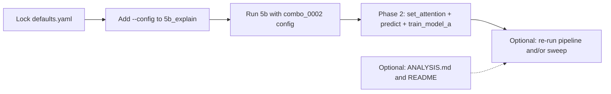

# Lock Best Config, Explain Best Run, Then Model A Attention

## Scope

- **Phase 1 (do first):** (1) Lock best sweep params into [config/defaults.yaml](config/defaults.yaml). (2) Enable explaining the best sweep run by adding `--config` to [scripts/5b_explain.py](scripts/5b_explain.py) and running it with the best combo’s config.
- **Phase 2 (then):** (4) Harden Model A attention (set_attention, predict fallback, training diagnostics) per [.cursor/plans/fix_attention_+_trustworthy_run_d52cdb1c.plan.md](.cursor/plans/fix_attention_+_trustworthy_run_d52cdb1c.plan.md).
- **Optional:** (3) Run another sweep (e.g. `--n-trials 10`, new `--batch-id`). (5) Add [outputs3/sweeps/optuna_3trial/ANALYSIS.md](outputs3/sweeps/optuna_3trial/ANALYSIS.md) and update README to cite the best run.

---

## Phase 1: Lock config and explain best run

### 1) Lock best config in defaults.yaml

Update [config/defaults.yaml](config/defaults.yaml) with the **sweep best** (Optuna trial 2, Spearman 0.2116):

| Section       | Key                | Current    | New             |
| ------------- | ------------------ | ---------- | --------------- |
| `training`    | `rolling_windows`  | `[10, 30]` | `[15, 30]`      |
| `model_a`     | `epochs`           | `28`       | `23`            |
| `model_b.xgb` | `max_depth`        | `4`        | `3`             |
| `model_b.xgb` | `learning_rate`    | `0.08`     | `0.087`         |
| `model_b.xgb` | `n_estimators`     | `250`      | `235`           |
| `model_b.rf`  | `n_estimators`     | `200`      | `232`           |
| `model_b.rf`  | `min_samples_leaf` | `5`        | `5` (unchanged) |

Add a short comment above `model_a` or `training` that these values are from sweep `outputs3/sweeps/optuna_3trial` best combo (trial 2).

### 2) Explain the best run (5b_explain on sweep combo)

**Current behavior:** [scripts/5b_explain.py](scripts/5b_explain.py) has no CLI; it always loads `config/defaults.yaml` and uses `config["paths"]["outputs"]`. So it runs against the **root** outputs dir (`outputs3/`), not the best sweep combo’s dir (`outputs3/sweeps/optuna_3trial/combo_0002/outputs/`).

**Change:** Add an optional `--config` argument to `5b_explain` (same pattern as [scripts/3_train_model_a.py](scripts/3_train_model_a.py) lines 136–142):

- `parser.add_argument("--config", type=str, default=None, help="Path to config YAML (default: config/defaults.yaml)")`
- If `args.config` is set, load that YAML; otherwise load `ROOT / "config" / "defaults.yaml"`. Resolve relative path against `ROOT`.

Then run explain on the **best sweep run**:

- From project root:  
`python -m scripts.5b_explain --config outputs3/sweeps/optuna_3trial/combo_0002/config.yaml`
- That combo config has `paths.outputs` pointing to `.../combo_0002/outputs`, so 5b will find `best_deep_set.pt` and `rf_model.joblib` there and write `shap_summary.png` and `ig_model_a_attributions.txt` into that same outputs dir (alongside `run_022/`).

No need to copy artifacts; the sweep already left models and run outputs in `combo_0002/outputs`.

---

## Phase 2: Model A attention (push performance further)

After Phase 1, implement the attention and trust fixes from [.cursor/plans/fix_attention_+_trustworthy_run_d52cdb1c.plan.md](.cursor/plans/fix_attention_+_trustworthy_run_d52cdb1c.plan.md):

1. **set_attention.py**
  Harden minutes reweighting when `mins_sum` is near zero (e.g. skip or clamp so normalization doesn’t blow up). [src/models/set_attention.py](src/models/set_attention.py) already has `COLLAPSE_THRESHOLD` and `_fallback_weights`; ensure fallback is used consistently when raw attention is zero/non-finite and that gradients still flow.
2. **predict.py**
  Clear fallback policy: when attention is all non-finite or zero, set `contributors_are_fallback=true` and do not emit fabricated zero-weight contributors (or document/warn).
3. **train_model_a.py**
  Keep or add attention diagnostics (e.g. `_log_attention_debug_stats`) so each epoch (or at least periodically) logs non-zero attention and gradient norms, as in the fix_attention plan.
4. **Re-run and re-sweep (optional)**
  After changes, run a single full pipeline from script 3 → 6 → 5 to confirm metrics, then optionally run another Optuna sweep to see if Spearman/NDCG improve.

---

## Optional: (3) More sweeps, (5) Reporting

- **(3) More sweeps:**  
`python -m scripts.sweep_hparams --method optuna --n-trials 10 --batch-id optuna_10trial`  
(or 20 trials, new batch-id). Uses the same DB and, after Phase 1, the locked best defaults as base; Optuna will still override params per trial.
- **(5) Reporting:**  
  - Add **outputs3/sweeps/optuna_3trial/ANALYSIS.md**: short summary of the 3 trials, best params (rolling_windows, epochs, XGB/RF), best Spearman (0.2116), NDCG, rank MAE; note that best run is `combo_0002/outputs/run_022`.  
  - In **README.md**, update the “Run 21 is the first real success” / outputs sentence to mention the sweep best run (e.g. `outputs3/sweeps/optuna_3trial`, combo_0002, run_022, Spearman 0.21) as the current best.

---

## Execution order

1. Edit `config/defaults.yaml` (best params + comment).
2. Edit `scripts/5b_explain.py` (add `--config`, load config from path).
3. Run `python -m scripts.5b_explain --config outputs3/sweeps/optuna_3trial/combo_0002/config.yaml` (foreground, from project root with PYTHONPATH set).
4. Phase 2: implement attention hardening and diagnostics; then optional pipeline run and/or sweep.
5. Optionally add ANALYSIS.md and README update.

---

## Files to touch

| Step | File                                                                                   | Action                                                                         |
| ---- | -------------------------------------------------------------------------------------- | ------------------------------------------------------------------------------ |
| 1    | [config/defaults.yaml](config/defaults.yaml)                                           | Set rolling_windows, model_a.epochs, model_b.xgb/rf to sweep best; add comment |
| 2    | [scripts/5b_explain.py](scripts/5b_explain.py)                                         | Add argparse and `--config`; load config from path when given                  |
| 4    | [src/models/set_attention.py](src/models/set_attention.py)                             | Harden minutes reweighting / collapse handling                                 |
| 4    | [src/inference/predict.py](src/inference/predict.py)                                   | Fallback policy for zero/non-finite attention                                  |
| 4    | [src/training/train_model_a.py](src/training/train_model_a.py)                         | Ensure attention diagnostics run                                               |
| 5    | [outputs3/sweeps/optuna_3trial/ANALYSIS.md](outputs3/sweeps/optuna_3trial/ANALYSIS.md) | New file: sweep summary (optional)                                             |
| 5    | [README.md](README.md)                                                                 | Cite sweep best run (optional)                                                 |

