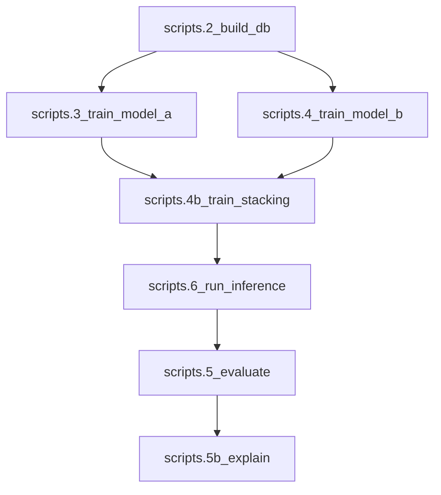

# Next Full Pipeline Run (Real Inference + Real Evaluation)

## Key metric meanings (what to optimize)

- **NDCG@k** (Normalized Discounted Cumulative Gain): measures *ranking quality with top emphasis*. Correct teams near the top matter much more than swaps near the bottom. Use when your priority is “get the top contenders right.”
- **Spearman ρ**: measures *global ordering agreement* (monotonic relationship) between true and predicted ranks/scores across the whole list. Use when you want the entire conference ordering to make sense.
- **MRR@1**: measures *top-1 hit rate* (did the #1 predicted team match the true best team?). Very strict; noisy with small validation sets.
- **RMSE** (Model B regression): average magnitude of numeric error in predicted win-rate/target; good for calibration but doesn’t directly optimize ordering.
- **ROC-AUC upset**: how well a score separates “upset vs non-upset” in a binary setting; 0.5 = random, 1.0 = perfect. (Only meaningful once wired to real upset labels.)

## Hyperparameters recommended from sweeps (why)

### Model A (Deep Set) — NDCG-first (your choice)

- **Pick**: `epochs=28` because it achieved best sweep **NDCG** (top-heavy ranking quality).
- **Set**: `early_stopping_patience=0` for this run so training reaches epoch 28 (current early stopping is based on val loss, not NDCG).
- **Keep**: `early_stopping_val_frac=0.25` for robustness.

Alternative options (for other objectives):

- **Spearman-first**: `epochs≈15` (best sweep Spearman).
- **Balanced**: implement NDCG-tracked early stopping (log NDCG each epoch; stop on plateau).

### Model B (XGB + RF) — ranking-first vs RMSE-first

Because we’re doing NDCG-first for Model A, the default recommendation is **ranking-first** for Model B:

- **Ranking-first** (best sweep `spearman_mean`):
  - XGB: `max_depth=4`, `learning_rate=0.08`, `n_estimators=250`
  - RF: `n_estimators=200`, `max_depth=12`, `min_samples_leaf=5`
- **RMSE-first** (best sweep `rmse_mean`):
  - XGB: `max_depth=4`, `learning_rate=0.10`, `n_estimators=300`
  - RF: `n_estimators=150`, `max_depth=12`, `min_samples_leaf=4`

## Critical plumbing to make this a “real” full run

Right now these are placeholders and must be wired:

- `scripts/5_evaluate.py` uses synthetic random data.
- `src/inference/predict.py` / `scripts/6_run_inference.py` uses dummy teams/scores.

## Implementation plan

- **Wire real inference** using DuckDB data.
  - Update [C:\Users\tmakucursor\worktrees\NBA_Playoff_Strentgh_Project\hbf\src\inference\predict.py](C:\Users\tmaku.cursor\worktrees\NBA_Playoff_Strentgh_Project\hbf\src\inference\predict.py)
    - Load DB via `load_training_data()`.
    - Choose an evaluation `as_of_date` (e.g., end of regular season for a completed season from `config/defaults.yaml`).
    - Build Model B features using `build_team_context_as_of_dates()`.
    - Build Model A roster tensors using `get_roster_as_of_date()` + rolling stats pipeline (reuse `src/training/model_a_data.py` utilities).
    - Run base models + RidgeCV meta, then write `outputs/<run_id>/predictions.json` + plots.
  - Update [C:\Users\tmakucursor\worktrees\NBA_Playoff_Strentgh_Project\hbf\scripts\6_run_inference.py](C:\Users\tmaku.cursor\worktrees\NBA_Playoff_Strentgh_Project\hbf\scripts\6_run_inference.py)
    - Add CLI flags for `--run-id` and `--as-of-date`.
- **Wire real evaluation** (ranking metrics on real labels).
  - Update [C:\Users\tmakucursor\worktrees\NBA_Playoff_Strentgh_Project\hbf\scripts\5_evaluate.py](C:\Users\tmaku.cursor\worktrees\NBA_Playoff_Strentgh_Project\hbf\scripts\5_evaluate.py)
    - Read `outputs/<run_id>/predictions.json`.
    - Compute **true ranks** for the same season from DB (start with season-end standings rank / win% rank; optionally add playoff performance rank once available in this repo).
    - Compute NDCG/Spearman/MRR using `src/evaluation/evaluate.py` + `src/evaluation/metrics.py`.
    - Write `outputs/<run_id>/eval_report.json` and (optionally) append to Notion “Run Metrics”.
- **Make Model B hyperparams actually take effect**
  - Update [C:\Users\tmakucursor\worktrees\NBA_Playoff_Strentgh_Project\hbf\src\models\xgb_model.py](C:\Users\tmaku.cursor\worktrees\NBA_Playoff_Strentgh_Project\hbf\src\models\xgb_model.py)
    - Currently only `n_estimators/max_depth/learning_rate/random_state` are used. Add support for `subsample` and `colsample_bytree` (used in sweeps) and set `early_stopping_rounds` in the constructor (modern XGBoost guidance).

## Run checklist (once wiring above is done)

- `python -m scripts.run_manifest`
- `python -m scripts.run_leakage_tests`
- `python -m scripts.1_download_raw` (if needed)
- `python -m scripts.2_build_db`
- Update `config/defaults.yaml` to NDCG-first hyperparams (Model A epochs=28, patience=0; Model B ranking-first or RMSE-first)
- `python -m scripts.3_train_model_a`
- `python -m scripts.4_train_model_b`
- `python -m scripts.4b_train_stacking`
- `python -m scripts.6_run_inference --run-id run_XXX --as-of-date <date>`
- `python -m scripts.5_evaluate --run-id run_XXX`
- `python -m scripts.5b_explain` (optional)

