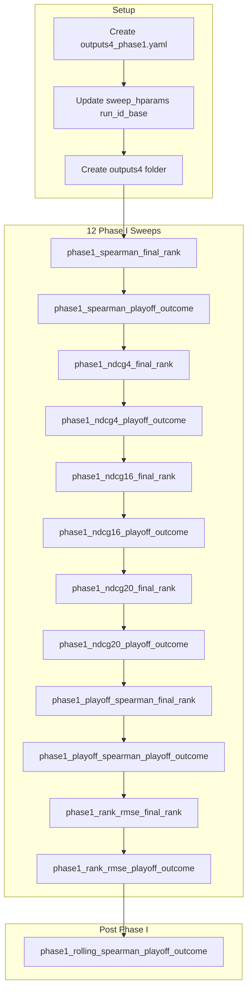

# Outputs4 Phase I Sweeps Plan

## 1. Config and Path Changes

### 1.1 Create outputs4 config override

Create `[config/outputs4_phase1.yaml](config/outputs4_phase1.yaml)` that extends defaults and baseline_max_features:

```yaml
# Outputs4 Phase I: new output root, run_id starting at 25
# Use with: --config config/outputs4_phase1.yaml
paths:
  outputs: "outputs4"

inference:
  run_id: null    # let pipeline reserve run_025, run_026, ...
  run_id_base: 25
```

### 1.2 Update sweep_hparams to use config run_id_base

In `[scripts/sweep_hparams.py](scripts/sweep_hparams.py)` (lines 204-206), replace hardcoded `run_024` / `24` with values from config:

```python
# Before (hardcoded):
cfg.setdefault("inference", {})["run_id"] = "run_024"
cfg.setdefault("inference", {})["run_id_base"] = 24

# After (from config):
run_base = config.get("inference", {}).get("run_id_base", 24)
cfg.setdefault("inference", {})["run_id"] = f"run_{run_base:03d}"
cfg.setdefault("inference", {})["run_id_base"] = run_base
```

**Note:** `config` is in scope inside `_run_one_combo` only indirectly; we must pass it. The function receives `config` as a copy (`cfg`). The `config` used for batch_dir is the loaded config before per-combo overrides. So we need to pass the run_id_base from the main config into `_run_one_combo`. Inspect the call chain: `_run_one_combo` is called from `_run_one_combo_worker` with `config` coming from the Optuna/grid loop. The `config` in main() has `inference.run_id_base` once we add it via outputs4_phase1.yaml. So when we merge baseline_max_features + outputs4_phase1, the final config will have run_id_base 25. The `cfg` inside *run_one_combo is a copy of that config (with combo-specific overrides). So we can read `run_base = cfg.get("inference", {}).get("run_id_base", 24)` at the start of the phase1 block, since we haven't overwritten inference yet. Actually the order is: cfg = copy.deepcopy(config), then we do cfg.setdefault("inference", {})["run_id"] = "run_024". So at that point cfg["inference"] might already have run_id_base from the merged config. So we should use: `run_base = cfg.get("inference", {}).get("run_id_base", 24)` and then set run_id to f"run*{run_base:03d}". Good.

### 1.3 Ensure outputs4 exists

Create `outputs4/` directory (or `.gitkeep`). Scripts will create `outputs4/sweeps/<batch_id>/` on first sweep.

---

## 2. Sweep Execution (FAST Implementation)

Use the same robust settings as [phased_sweep_execution_plan_d0f3e0a3.plan.md](.cursor/plans/phased_sweep_execution_plan_d0f3e0a3.plan.md):

- **Config:** `config/outputs4_phase1.yaml` (merge order: defaults + baseline_max_features + outputs4_phase1)
- **Sweep config:** `config/baseline_max_features.yaml` supplies training max_lists_oof/max_final_batches and sweep ranges
- **Merge strategy:** Create outputs4_phase1.yaml to override paths and inference; when used with `--config config/outputs4_phase1.yaml`, we need baseline_max_features merged too. Options:
  - **A:** outputs4_phase1.yaml imports/extends baseline_max_features (YAML doesn't natively do that; we'd need a convention or a single combined file)
  - **B:** Use two config files — sweep only takes one --config. We'd need to modify _load_config to accept multiple configs, or
  - **C:** Create `config/outputs4_baseline.yaml` that contains both baseline_max_features overrides AND paths.outputs + inference.run_id_base

Simplest: **config/outputs4_phase1.yaml** contains:

- paths.outputs: "outputs4"
- inference.run_id_base: 25, run_id: null
- training: max_lists_oof, max_final_batches (copy from baseline_max_features)
- sweep: (copy from baseline_max_features)

That way a single `--config config/outputs4_phase1.yaml` gives us everything. We can also have it extend defaults only and add the outputs4 + inference overrides, then separately the user passes `--config config/baseline_max_features.yaml` for sweep params... but sweep takes one config. The plan says "baseline_max_features" for training params. So outputs4_phase1.yaml should include the baseline_max_features training and sweep sections so we have one config.

**Final config design:**

- `config/outputs4_phase1.yaml`: paths.outputs = "outputs4"; inference.run_id_base = 25, run_id = null; plus the training and sweep sections from baseline_max_features (so one config does both).

### 2.1 Command template (per phased plan)

```powershell
python -m scripts.sweep_hparams --method optuna --n-trials 12 --n-jobs 4 --no-run-explain --objective <OBJ> --listmle-target <TARGET> --phase phase1 --batch-id phase1_<OBJ>_<TARGET> --config config/outputs4_phase1.yaml
```

### 2.2 Sweep order (all 6 objectives, 2 listmle_targets each = 12 sweeps)


| #   | Objective        | listmle_target  | batch_id                                |
| --- | ---------------- | --------------- | --------------------------------------- |
| 1   | spearman         | final_rank      | phase1_spearman_final_rank              |
| 2   | spearman         | playoff_outcome | phase1_spearman_playoff_outcome         |
| 3   | ndcg4            | final_rank      | phase1_ndcg4_final_rank                 |
| 4   | ndcg4            | playoff_outcome | phase1_ndcg4_playoff_outcome            |
| 5   | ndcg16           | final_rank      | phase1_ndcg16_final_rank                |
| 6   | ndcg16           | playoff_outcome | phase1_ndcg16_playoff_outcome           |
| 7   | ndcg20           | final_rank      | phase1_ndcg20_final_rank                |
| 8   | ndcg20           | playoff_outcome | phase1_ndcg20_playoff_outcome           |
| 9   | playoff_spearman | final_rank      | phase1_playoff_spearman_final_rank      |
| 10  | playoff_spearman | playoff_outcome | phase1_playoff_spearman_playoff_outcome |
| 11  | rank_rmse        | final_rank      | phase1_rank_rmse_final_rank             |
| 12  | rank_rmse        | playoff_outcome | phase1_rank_rmse_playoff_outcome        |


### 2.3 Post-sweep: rolling windows (Step 5 of phased plan)

After all 12 sweeps, run the rolling windows sweep:

```powershell
python -m scripts.sweep_hparams --method optuna --n-trials 12 --n-jobs 4 --no-run-explain --objective spearman --listmle-target playoff_outcome --phase rolling --batch-id phase1_rolling_spearman_playoff_outcome --config config/outputs4_phase1.yaml
```

### 2.4 Sequential sweep commands (run one after another)

To run all 12 Phase I sweeps sequentially (not in parallel), use semicolons in PowerShell. Each sweep runs after the previous completes. Use `config/outputs4_phase1.yaml` once created.

```powershell
$cfg = "config/outputs4_phase1.yaml"
python -m scripts.sweep_hparams --method optuna --n-trials 12 --n-jobs 4 --no-run-explain --objective spearman --listmle-target final_rank --phase phase1 --batch-id phase1_spearman_final_rank --config $cfg; python -m scripts.sweep_hparams --method optuna --n-trials 12 --n-jobs 4 --no-run-explain --objective spearman --listmle-target playoff_outcome --phase phase1 --batch-id phase1_spearman_playoff_outcome --config $cfg; python -m scripts.sweep_hparams --method optuna --n-trials 12 --n-jobs 4 --no-run-explain --objective ndcg4 --listmle-target final_rank --phase phase1 --batch-id phase1_ndcg4_final_rank --config $cfg; python -m scripts.sweep_hparams --method optuna --n-trials 12 --n-jobs 4 --no-run-explain --objective ndcg4 --listmle-target playoff_outcome --phase phase1 --batch-id phase1_ndcg4_playoff_outcome --config $cfg; python -m scripts.sweep_hparams --method optuna --n-trials 12 --n-jobs 4 --no-run-explain --objective ndcg16 --listmle-target final_rank --phase phase1 --batch-id phase1_ndcg16_final_rank --config $cfg; python -m scripts.sweep_hparams --method optuna --n-trials 12 --n-jobs 4 --no-run-explain --objective ndcg16 --listmle-target playoff_outcome --phase phase1 --batch-id phase1_ndcg16_playoff_outcome --config $cfg; python -m scripts.sweep_hparams --method optuna --n-trials 12 --n-jobs 4 --no-run-explain --objective ndcg20 --listmle-target final_rank --phase phase1 --batch-id phase1_ndcg20_final_rank --config $cfg; python -m scripts.sweep_hparams --method optuna --n-trials 12 --n-jobs 4 --no-run-explain --objective ndcg20 --listmle-target playoff_outcome --phase phase1 --batch-id phase1_ndcg20_playoff_outcome --config $cfg; python -m scripts.sweep_hparams --method optuna --n-trials 12 --n-jobs 4 --no-run-explain --objective playoff_spearman --listmle-target final_rank --phase phase1 --batch-id phase1_playoff_spearman_final_rank --config $cfg; python -m scripts.sweep_hparams --method optuna --n-trials 12 --n-jobs 4 --no-run-explain --objective playoff_spearman --listmle-target playoff_outcome --phase phase1 --batch-id phase1_playoff_spearman_playoff_outcome --config $cfg; python -m scripts.sweep_hparams --method optuna --n-trials 12 --n-jobs 4 --no-run-explain --objective rank_rmse --listmle-target final_rank --phase phase1 --batch-id phase1_rank_rmse_final_rank --config $cfg; python -m scripts.sweep_hparams --method optuna --n-trials 12 --n-jobs 4 --no-run-explain --objective rank_rmse --listmle-target playoff_outcome --phase phase1 --batch-id phase1_rank_rmse_playoff_outcome --config $cfg
```

**Alternative:** Save the above to `run_phase1_sweeps.ps1` and execute with `.\run_phase1_sweeps.ps1`. Then run the rolling sweep separately:

```powershell
python -m scripts.sweep_hparams --method optuna --n-trials 12 --n-jobs 4 --no-run-explain --objective spearman --listmle-target playoff_outcome --phase rolling --batch-id phase1_rolling_spearman_playoff_outcome --config config/outputs4_phase1.yaml
```

---

## 3. Documentation Updates

- **README.md:** Add outputs4 to Report Assets; note that outputs4 is the Phase I sweep root with run_025+.
- **[outputs4/sweeps/SWEEP_PHASE1_ANALYSIS.md](outputs4/sweeps/SWEEP_PHASE1_ANALYSIS.md):** Create after first sweep; add sections per objective (from phased plan Step 2b).
- **phased_sweep_execution_plan:** Add a note that outputs4 + run_025 is the current Phase I root.

---

## 4. File Summary


| Action | File                                                           |
| ------ | -------------------------------------------------------------- |
| Create | `config/outputs4_phase1.yaml`                                  |
| Edit   | `scripts/sweep_hparams.py` (use config run_id_base)            |
| Create | `outputs4/.gitkeep` or let first run create outputs4           |
| Edit   | `README.md` (outputs4 in Report Assets)                        |
| Create | `outputs4/sweeps/SWEEP_PHASE1_ANALYSIS.md` (after first sweep) |


---

## 5. Execution Flow




---

## 6. Git Commit and Push

Before starting sweeps and after plan/config changes:

```powershell
git add .cursor/plans/outputs4_phase_i_sweeps_2638c514.plan.md config/outputs4_phase1.yaml scripts/sweep_hparams.py outputs4/.gitkeep README.md
git status
git commit -m "Outputs4 Phase I: outputs4 config, run_id 25, sequential sweep commands, README update"
git push origin main
```

After each sweep batch (optional): commit sweep results and analysis:

```powershell
git add outputs4/sweeps/
git commit -m "Phase I: sweep results for <batch_id>"
git push origin main
```

---

## 7. Notion Update (if connected)

Per project rules, update related Notion pages: set page icon to robot (🤖) and add a task or doc entry for "Outputs4 Phase I sweeps (run_025+)" with link to this plan.