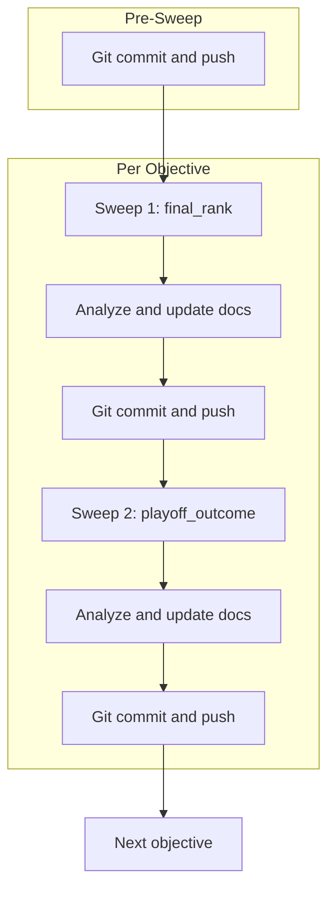

# Phased Sweep Execution Plan (Agent-Mode)

Executable plan derived from [.cursor/plans/phased_sweep_roadmap_3hr_6b5aa588.plan.md](.cursor/plans/phased_sweep_roadmap_3hr_6b5aa588.plan.md). Phase 0 complete; Phase 1 pending.

---

## Prerequisites (verify before starting)

- [scripts/sweep_hparams.py](scripts/sweep_hparams.py): `--phase phase1` exists with narrowed ranges (epochs 14-26, max_depth 3-5, lr 0.06-0.10, n_xgb 200-300, n_rf 150-230, min_leaf 4-6)
- [config/baseline_max_features.yaml](config/baseline_max_features.yaml): exists with max_lists_oof, max_final_batches raised
- cwd: project root; `PYTHONPATH` set to project root

---

## Step 1: Git commit and push (before any sweeps)

1. `git add` modified files: scripts, docs, plans, outputs3/sweeps/BASELINE_SWEEP_ANALYSIS.md, scripts/aggregate_sweep_results.py
2. Add Phase 0 sweep outputs: `outputs3/sweeps/baseline_ndcg_playoff_outcome/` (if not in .gitignore)
3. Optionally add: data/modern_RAPTOR_by_team.csv, docs/Team_Records.csv, docs/modern_RAPTOR_by_team.csv (user decision)
4. `git commit -m "Phase 0 complete; add phase1, ndcg4/16/20, aggregate script; doc updates"`
5. `git push origin main`

**Rule:** outputs3/sweeps must be pushed before starting sweeps ([outputs3/sweeps/BASELINE_SWEEP_ANALYSIS.md](outputs3/sweeps/BASELINE_SWEEP_ANALYSIS.md) workflow).

---

## Step 2: Sweep execution loop (per objective)

For each objective in order: `spearman`, `ndcg4`, `ndcg16`, `ndcg20`, `playoff_spearman`, `rank_rmse`:

### 2a. Sweep 1 — final_rank (standings)

```powershell
python -m scripts.sweep_hparams --method optuna --n-trials 20 --n-jobs 4 --objective <OBJ> --listmle-target final_rank --phase phase1 --batch-id phase1_<OBJ>_final_rank --config config/baseline_max_features.yaml
```

Replace `<OBJ>` with the objective (e.g. `spearman`, `ndcg4`).

**Constraint:** Sweeps run ~75 min each. Use maximum allowed timeout. If the run times out, the sweep may be interrupted — use Step 2c to aggregate partial results.

### 2b. Analyze and update docs (after Sweep 1)

1. Read `outputs3/sweeps/phase1_<OBJ>_final_rank/sweep_results_summary.json`, `sweep_results.csv`, `optuna_importances.json`
2. Compare best combo to run_022, run_023, and previous sweeps
3. Add a section to [outputs3/sweeps/BASELINE_SWEEP_ANALYSIS.md](outputs3/sweeps/BASELINE_SWEEP_ANALYSIS.md) (or create `SWEEP_PHASE1_ANALYSIS.md`) with:
  - batch_id, objective, listmle_target
  - Best combo params and metrics
  - Comparison table
4. Update [docs/HYPOTHESIZED_BEST_CONFIG_AND_METRIC_INSIGHTS.md](docs/HYPOTHESIZED_BEST_CONFIG_AND_METRIC_INSIGHTS.md) with actual results if material
5. `git add`; `git commit -m "Phase 1: <OBJ> final_rank sweep results"`; `git push origin main`

### 2c. If sweep was interrupted

```powershell
python -m scripts.aggregate_sweep_results --batch-id phase1_<OBJ>_final_rank --objective <OBJ>
```

Then proceed with 2b using the generated summary files.

### 2d. Sweep 2 — playoff_outcome

Same as 2a with `--listmle-target playoff_outcome --batch-id phase1_<OBJ>_playoff_outcome`. Then repeat 2b (and 2c if needed).

### 2e. Proceed to next objective

Only after both sweeps (final_rank and playoff_outcome) for the current objective are analyzed and committed.

---

## Step 3: Sweep invocation table


| Objective        | Sweep 1 batch_id                   | Sweep 2 batch_id                        |
| ---------------- | ---------------------------------- | --------------------------------------- |
| spearman         | phase1_spearman_final_rank         | phase1_spearman_playoff_outcome         |
| ndcg4            | phase1_ndcg4_final_rank            | phase1_ndcg4_playoff_outcome            |
| ndcg16           | phase1_ndcg16_final_rank           | phase1_ndcg16_playoff_outcome           |
| ndcg20           | phase1_ndcg20_final_rank           | phase1_ndcg20_playoff_outcome           |
| playoff_spearman | phase1_playoff_spearman_final_rank | phase1_playoff_spearman_playoff_outcome |
| rank_rmse        | phase1_rank_rmse_final_rank        | phase1_rank_rmse_playoff_outcome        |


---

## Step 4: Long-running sweep handling

- Each sweep is ~~75 min. Agent `run_terminal_cmd` may timeout (~~10 min).
- **Option A:** Agent runs sweep with max timeout; if it times out, output the exact command for the user to run manually. On next turn, user reports completion and agent continues with analysis.
- **Option B:** Agent skips running sweeps and only performs: (1) Git commit/push, (2) Doc updates when user provides sweep output paths. User runs sweeps manually.
- **Recommendation:** Agent performs Step 1 (commit/push). For sweeps, agent outputs the command; user runs it; agent performs analysis and doc updates when user indicates the sweep finished.

---

## Step 5: Phase 2 planning (after all 12 sweeps)

1. Review which objective + listmle_target performed best on each metric
2. Use optuna_importances to decide Phase 2 search ranges
3. Create `.cursor/plans/PHASE2_SWEEP_PLAN.md` with narrowed ranges and objectives

---

## Files modified per iteration

- [outputs3/sweeps/BASELINE_SWEEP_ANALYSIS.md](outputs3/sweeps/BASELINE_SWEEP_ANALYSIS.md) or `outputs3/sweeps/SWEEP_PHASE1_ANALYSIS.md` — add sweep section
- [docs/HYPOTHESIZED_BEST_CONFIG_AND_METRIC_INSIGHTS.md](docs/HYPOTHESIZED_BEST_CONFIG_AND_METRIC_INSIGHTS.md) — update best config table
- [.cursor/plans/phased_sweep_roadmap_3hr_6b5aa588.plan.md](.cursor/plans/phased_sweep_roadmap_3hr_6b5aa588.plan.md) — mark completed todos

---

## Mermaid: Execution flow




