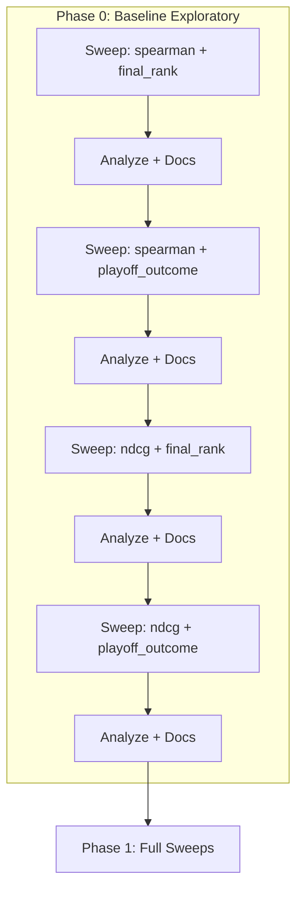
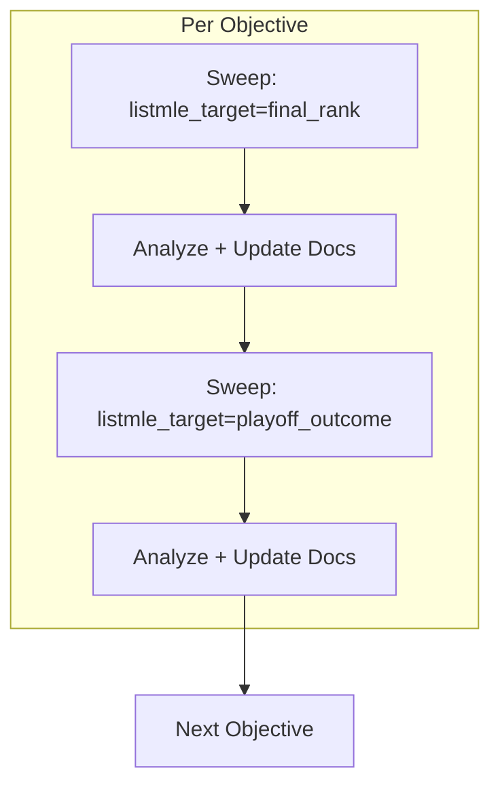

# Phased Hyperparameter Sweep Roadmap

---

## Phase 0: COMPLETE (2025-02)

All 4 baseline sweeps ran. See [outputs3/sweeps/BASELINE_SWEEP_ANALYSIS.md](outputs3/sweeps/BASELINE_SWEEP_ANALYSIS.md).

| Sweep | Status | Best ndcg | Best spearman | Best playoff_spearman |
|-------|--------|-----------|---------------|-----------------------|
| baseline_spearman_final_rank | Done | 0.483 | 0.492 | 0.499 |
| baseline_spearman_playoff_outcome | Done | 0.483 | **0.512** | **0.513** |
| baseline_ndcg_final_rank | Done | 0.486 | 0.483 | 0.511 |
| baseline_ndcg_playoff_outcome | Done (4/6 combos aggregated) | 0.486 | 0.485 | 0.504 |

**Phase 1 ranges (from optuna_importances):** Fix subsample, rolling_windows, colsample_bytree at default. Focus on: learning_rate, min_samples_leaf, n_estimators_rf, n_estimators_xgb, model_a_epochs, max_depth.

### Next steps (roadmap)

1. **Commit and push** Phase 0 outputs (BASELINE_SWEEP_ANALYSIS.md, baseline_ndcg_playoff_outcome sweep results, aggregate script).
2. **Add `--phase phase1`** to sweep_hparams with narrowed Optuna ranges (epochs 14–26, max_depth 3–5, lr 0.06–0.10, n_xgb 200–300, n_rf 150–230, min_leaf 4–6).
3. **Run Phase 1 spearman** (first objective):
   - `phase1_spearman_final_rank` — 20 trials, n_jobs 4, foreground, no timeout
   - Analyze; update docs
   - `phase1_spearman_playoff_outcome` — same
   - Analyze; update docs
4. **Run Phase 1 ndcg** (second objective) — same pattern.
5. **Continue** with ndcg4, ndcg16, ndcg20, playoff_spearman, rank_rmse per timing map.

---

## Phase 0: Baseline Exploratory Sweeps (reference)

**Goal:** Run 2 baseline sweeps each for **spearman** and **ndcg**, evaluating against both **end-of-playoff rank** and **playoff standings**, with **max player features** and the **smallest combination of hyperparameters** that covers the **widest range possible** — to decide where to start full sweeps.

### Sweep Count


| Objective | listmle_target  | Purpose                                                |
| --------- | --------------- | ------------------------------------------------------ |
| spearman  | final_rank      | Train on standings; evaluate against standings         |
| spearman  | playoff_outcome | Train on playoff result; evaluate against playoff rank |
| ndcg      | final_rank      | Train on standings; evaluate against standings         |
| ndcg      | playoff_outcome | Train on playoff result; evaluate against playoff rank |


**Total: 4 baseline sweeps**

### Max Player Features Config

Use config overrides to maximize player feature richness (before any speed caps):

- **stat_dim:** 21 (18 base L10/L30 + 2 on_court_pm + 1 pct_min_returning)
- **rolling_windows:** [10, 30] (L10 and L30)
- **roster_size:** 15
- **max_lists_oof:** raise (e.g. 100) or remove cap to use full lists
- **max_final_batches:** raise (e.g. 100) or remove cap

**Implementation:** Create [config/baseline_max_features.yaml](config/baseline_max_features.yaml) that extends defaults with these values. Add `--config` support to sweep (sweep currently loads only `defaults.yaml`; extend to accept `--config path`) so it loads this baseline. Sweep will merge/override only sweep-specific params (epochs, max_depth, etc.) while using baseline for feature/Model A caps.

### Smallest Combination Covering Widest Range

Use **minimal trials** (n_trials = 6 or 8) with **full min-max ranges** for all sweep params so Optuna samples across the space:


| Param            | Min      | Max      | Rationale                   |
| ---------------- | -------- | -------- | --------------------------- |
| model_a_epochs   | 8        | 28       | Full range                  |
| max_depth        | 3        | 6        | Shallow to deep trees       |
| learning_rate    | 0.05     | 0.12     | Low to high LR              |
| n_estimators_xgb | 200      | 350      | Few to many trees           |
| n_estimators_rf  | 150      | 250      | Few to many trees           |
| min_samples_leaf | 4        | 6        | Low to high regularization  |
| rolling_windows  | [10, 30] | [10, 30] | Single value (max features) |


**n_trials: 6 or 8** — enough to sample corners and midpoints; Optuna TPE will suggest diverse points within these bounds.

**Sweep invocation:** Pass `n_trials=6` directly. Add `--phase baseline` to sweep that sets wide ranges for Optuna: epochs 8–28, max_depth 3–6, lr 0.05–0.12, n_xgb 200–350, n_rf 150–250, min_leaf 4–6. Or add these ranges to a `sweep.baseline` section in `baseline_max_features.yaml`.

### Phase 0 Invocation Sequence

```powershell
# Baseline config (max features)
# Ensure config/baseline_max_features.yaml exists with max_lists_oof, max_final_batches raised

# spearman + standings (final_rank)
python -m scripts.sweep_hparams --method optuna --n-trials 6 --n-jobs 4 --objective spearman --listmle-target final_rank --batch-id baseline_spearman_final_rank --config config/baseline_max_features.yaml

# [ANALYZE; update docs]
# spearman + playoff (playoff_outcome)
python -m scripts.sweep_hparams --method optuna --n-trials 6 --n-jobs 4 --objective spearman --listmle-target playoff_outcome --batch-id baseline_spearman_playoff_outcome --config config/baseline_max_features.yaml

# [ANALYZE; update docs]
# ndcg + standings (final_rank)
python -m scripts.sweep_hparams --method optuna --n-trials 6 --n-jobs 4 --objective ndcg --listmle-target final_rank --batch-id baseline_ndcg_final_rank --config config/baseline_max_features.yaml

# [ANALYZE; update docs]
# ndcg + playoff (playoff_outcome)
python -m scripts.sweep_hparams --method optuna --n-trials 6 --n-jobs 4 --objective ndcg --listmle-target playoff_outcome --batch-id baseline_ndcg_playoff_outcome --config config/baseline_max_features.yaml
```

### Phase 0 Timing

- **Per sweep:** ceil(6/4) × 15 min = **30 min**
- **Per sweep + analysis:** 30 + 15 = **45 min**
- **Total Phase 0:** 4 × 45 = **180 min (3 hours)**

### Phase 0 Output → Phase 1 Planning

After Phase 0:

1. **Review** optuna_importances.json from each sweep — which params matter most?
2. **Review** best params from each sweep — do standings vs playoff favor different regions?
3. **Decide** Phase 1 search ranges: narrow around promising regions or keep full range with more trials.
4. **Document** in `BASELINE_SWEEP_ANALYSIS.md` and update [docs/HYPOTHESIZED_BEST_CONFIG_AND_METRIC_INSIGHTS.md](docs/HYPOTHESIZED_BEST_CONFIG_AND_METRIC_INSIGHTS.md) with baseline results before proceeding to Phase 1.

### Phase 0 Mermaid Flow



---

## Phase 1: Phased Sweep Roadmap (3-Hour Batches)

### Time Model

Per [docs/HYPERPARAMETER_TESTING_EVOLUTION.md](docs/HYPERPARAMETER_TESTING_EVOLUTION.md): each trial runs the full pipeline (3 → 4 → 4b → 6 → 5) in **10–30 minutes** (assume **15 min average**).


| Setting         | Value   | Wall Time per Sweep              |
| --------------- | ------- | -------------------------------- |
| n_trials        | 20      | ceil(20/4) × 15 min = **75 min** |
| n_jobs          | 4       | 4 pipelines in parallel          |
| Analysis + docs | ~15 min | After each sweep                 |


**Per objective (2 sweeps: standings + playoff):** 2 × 75 + 2 × 15 = **180 min (3 hours)**.

---

## Sweep Structure

### Objectives (sweep optimization)

- `spearman`, `ndcg4`, `ndcg16`, `ndcg20`, `playoff_spearman`, `rank_rmse`
- **Eval/analytics only** (calculated but not sweep objectives): `ndcg`, `ndcg10`, `ndcg12`, `rank_mae`

### ListMLE Target (2 per objective)

- `**final_rank**` — EOS standings (regular-season final rank; config key `listmle_target: final_rank`)
- `**playoff_outcome**` — EOS playoff result, champion=1 (config key `listmle_target: playoff_outcome`)

### Order per Objective

1. Sweep with `listmle_target: final_rank` (standings)
2. Analyze results; update docs; compare to past runs
3. Sweep with `listmle_target: playoff_outcome` (playoff)
4. Analyze results; update docs; compare to past runs
5. Move to next objective

---

## Timing Map per Objective


| Objective        | Sweep 1 (final_rank) | Analysis | Sweep 2 (playoff_outcome) | Analysis | Total       |
| ---------------- | -------------------- | -------- | ------------------------- | -------- | ----------- |
| spearman         | 75 min               | 15 min   | 75 min                    | 15 min   | **180 min** |
| ndcg4            | 75 min               | 15 min   | 75 min                    | 15 min   | **180 min** |
| ndcg16           | 75 min               | 15 min   | 75 min                    | 15 min   | **180 min** |
| ndcg20           | 75 min               | 15 min   | 75 min                    | 15 min   | **180 min** |
| playoff_spearman | 75 min               | 15 min   | 75 min                    | 15 min   | **180 min** |
| rank_rmse        | 75 min               | 15 min   | 75 min                    | 15 min   | **180 min** |


**Phase 1 total (all 6 objectives):** 6 × 180 = **1,080 min (~18 hours)** if run sequentially.

Each objective batch stays within **3 hours**.

---

## Required Code Change

### Add `--listmle-target` to sweep_hparams

[sweep_hparams.py](scripts/sweep_hparams.py) currently does **not** override `listmle_target`; it uses the value from config.

1. Add argument:
  ```python
   parser.add_argument("--listmle-target", type=str, default=None,
       choices=(None, "final_rank", "playoff_outcome"),
       help="Override training.listmle_target for this sweep (final_rank=standings, playoff_outcome=playoff result).")
  ```
2. In `_run_one_combo`, when writing combo config:
  ```python
   if listmle_target is not None:
       cfg["training"]["listmle_target"] = listmle_target
  ```
3. Pass `listmle_target` from `main()` into `_run_one_combo` (and the Optuna objective closure).
4. Use a batch_id convention that encodes objective and target, e.g.:
  - `{objective}_{listmle_target}_{timestamp}` — e.g. `spearman_final_rank_20250203_120000`
  - Or manual: `--batch-id spearman_final_rank`

---

## Invocation Sequence (per objective)

```powershell
# Objective: spearman
# Sweep 1: standings (final_rank)
python -m scripts.sweep_hparams --method optuna --n-trials 20 --n-jobs 4 --objective spearman --listmle-target final_rank --batch-id spearman_final_rank

# [ANALYZE: sweep_results_summary.json, sweep_results.csv; update docs]
# Sweep 2: playoff (playoff_outcome)
python -m scripts.sweep_hparams --method optuna --n-trials 20 --n-jobs 4 --objective spearman --listmle-target playoff_outcome --batch-id spearman_playoff_outcome

# [ANALYZE; update docs]
# Next objective...
```

Same pattern for `ndcg`, `ndcg10`, `playoff_spearman`, `rank_mae`, `rank_rmse`.

---

## Analysis and Doc-Update Checklist (after each sweep)

1. **Read outputs**
  - `outputs3/sweeps/<batch_id>/sweep_results_summary.json` — `best_by_*` entries
  - `outputs3/sweeps/<batch_id>/sweep_results.csv` — full trial metrics
  - `outputs3/sweeps/<batch_id>/optuna_importances.json` — param importance
2. **Compare to past runs**
  - Compare best combo metrics to run_022, run_023, and previous sweeps
  - Note which objective + listmle_target performed best on each metric
3. **Update docs**
  - [outputs2/sweeps/SWEEP_ANALYSIS_REPORT.md](outputs2/sweeps/SWEEP_ANALYSIS_REPORT.md) or new `outputs3/sweeps/SWEEP_PHASE1_ANALYSIS.md` — add section for this sweep (batch_id, objective, listmle_target, best metrics, comparison)
  - [docs/HYPOTHESIZED_BEST_CONFIG_AND_METRIC_INSIGHTS.md](docs/HYPOTHESIZED_BEST_CONFIG_AND_METRIC_INSIGHTS.md) — update hypothesized best config table with actual results
  - [docs/CHECKPOINT_PROJECT_REPORT.md](docs/CHECKPOINT_PROJECT_REPORT.md) — add sweep results summary if material
4. **No next sweep until analysis is done** — explicitly stop and update docs before running the next sweep.

---

## Robustness Adjustments

- **4-hour budget per objective:** Use `n_trials=12`, `--no-run-explain` so each objective batch (2 sweeps + analysis) finishes in &lt; 4 hours with 4 jobs. See [phased_sweep_execution_plan_d0f3e0a3.plan.md](phased_sweep_execution_plan_d0f3e0a3.plan.md).
- If trials run longer than 15 min (e.g. 25 min), `n_trials=12` keeps sweep under 90 min: `ceil(12/4) × 25 = 75 min`; with 30 min trials: 90 min.
- If a sweep finishes early (Optuna early-stop or fewer trials), use the saved time for extra analysis or documentation.

---

## How to speed up sweeps

| Tactic | Effect | Trade-off |
|--------|--------|-----------|
| **`--n-jobs 4`** | Wall time ≈ trials/n_jobs × per-trial time (e.g. 20 trials × 15 min / 4 → ~75 min) | Memory scales with workers; need stable DB/disk |
| **`--n-trials 6`** | Exploratory sweeps finish in ~30 min (with n_jobs=4) | Fewer samples; use for Phase 0, increase to 20 for Phase 1 |
| **`--phase baseline`** | Wide ranges, few trials; quick exploration | Less coverage; narrow ranges for follow-up |
| **`--no-run-explain`** | Skip SHAP/IG on best combo; saves ~5–10 min per sweep | No explain artifacts for best config |
| **Lower max_lists_oof, max_final_batches** | Faster Model A training (e.g. 50 vs 100) | Fewer lists processed; may affect quality |

---

## NDCG@k Hypotheses (sweep objectives)

Per NBA playoff structure and [docs/HYPOTHESIZED_BEST_CONFIG_AND_METRIC_INSIGHTS.md](docs/HYPOTHESIZED_BEST_CONFIG_AND_METRIC_INSIGHTS.md) §3.6:

| Sweep objective | Rationale                                              | Expected strength                    |
|-----------------|--------------------------------------------------------|--------------------------------------|
| **ndcg4**       | Final four; top-heavy ranking                          | Best at MRR (champion/runner-up)     |
| **ndcg16**      | Full 16-team playoff field                             | Best at “who makes playoffs”         |
| **ndcg20**      | Includes play-in zone (seeds 7–10)                      | Best at handling play-in noise       |

**Eval/analytics only** (calculated but not sweep objectives): ndcg, ndcg10, ndcg12, rank_mae.

---

## Phase 2 Planning (after Phase 1)

After one sweep per (objective, listmle_target):

1. **Review**
  - Which objectives improved most with standings vs playoff?
  - Which hyperparameters (from optuna_importances) had highest impact?
  - Did any config beat run_022 / run_023 on key metrics?
2. **Decide**
  - Narrow search space for Phase 2 (e.g. fix low-importance params)
  - Prioritize objectives that showed most gain
  - Optionally run Phase 2 with `--phase phase1_xgb` or `phase2_rf` for focused Model B tuning
  - Consider NDCG@4, NDCG@16, NDCG@20 sweeps per hypotheses above
3. **Document**
  - Create `PHASE2_SWEEP_PLAN.md` in `.cursor/plans/` with updated ranges and objectives

---

## Mermaid: Sweep Flow




---

## Files to Modify


| File                                                                   | Change                                                                                                          |
| ---------------------------------------------------------------------- | --------------------------------------------------------------------------------------------------------------- |
| [scripts/sweep_hparams.py](scripts/sweep_hparams.py)                   | Add `--listmle-target`; add `--config` to load alternate config; add `--phase baseline` with wide Optuna ranges |
| [config/baseline_max_features.yaml](config/baseline_max_features.yaml) | New: extends defaults with max_lists_oof, max_final_batches raised; optional sweep.baseline ranges              |
| [.cursor/plans/](.cursor/plans/)                                       | This plan: `phased_sweep_roadmap_3hr_6b5aa588.plan.md`                                                          |
| [docs/](docs/)                                                         | Analysis template or checklist for post-sweep updates                                                           |
| [outputs3/sweeps/](outputs3/sweeps/)                                   | BASELINE_SWEEP_ANALYSIS.md (Phase 0), SWEEP_PHASE1_ANALYSIS.md (Phase 1, created when first Phase 1 sweep runs) |


